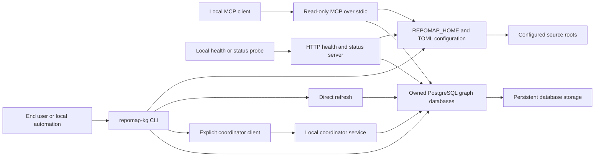
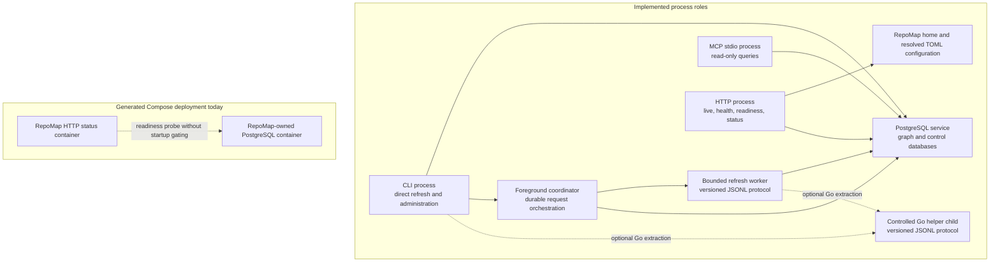
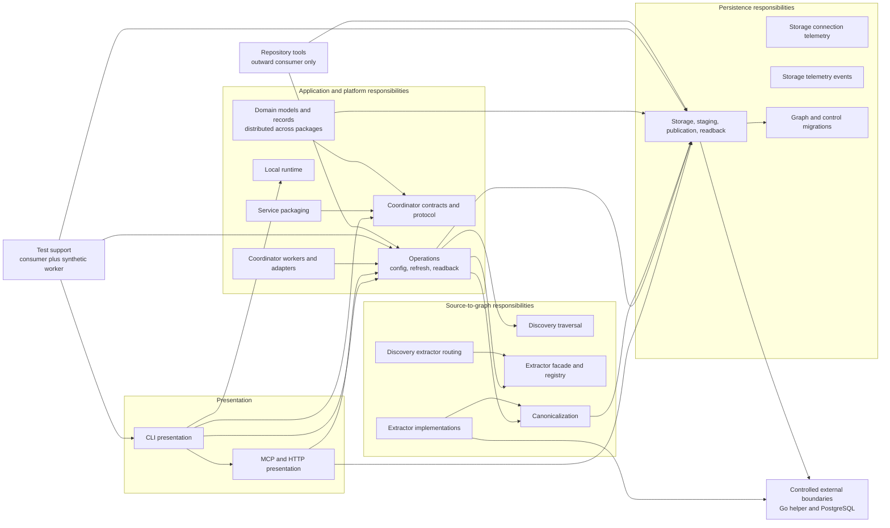
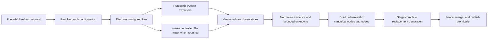
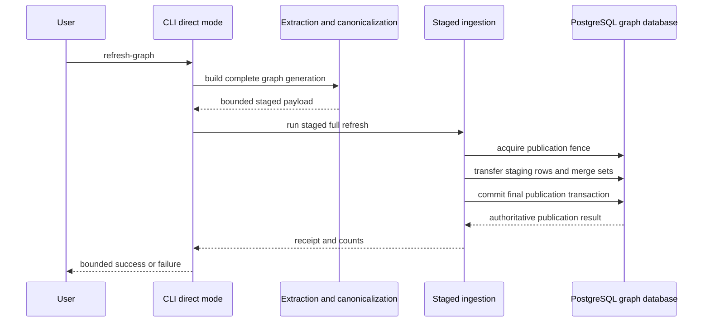
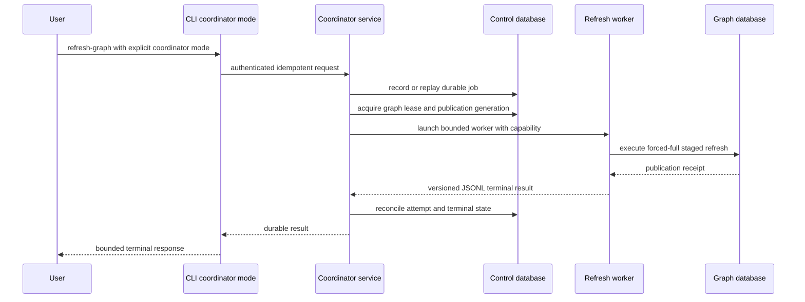
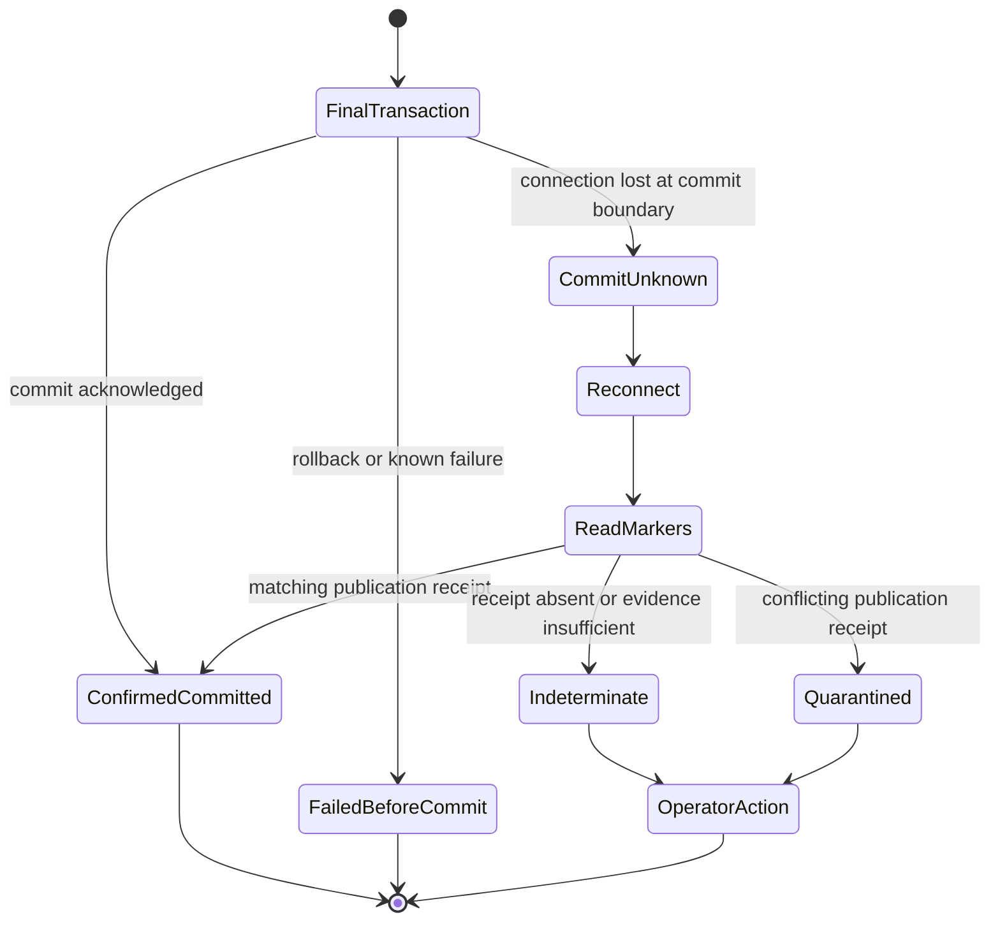
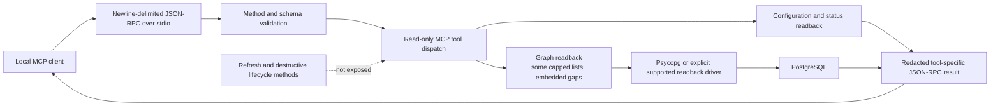
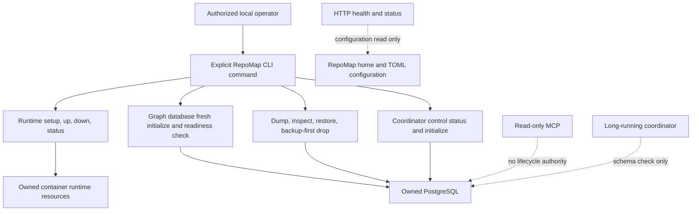
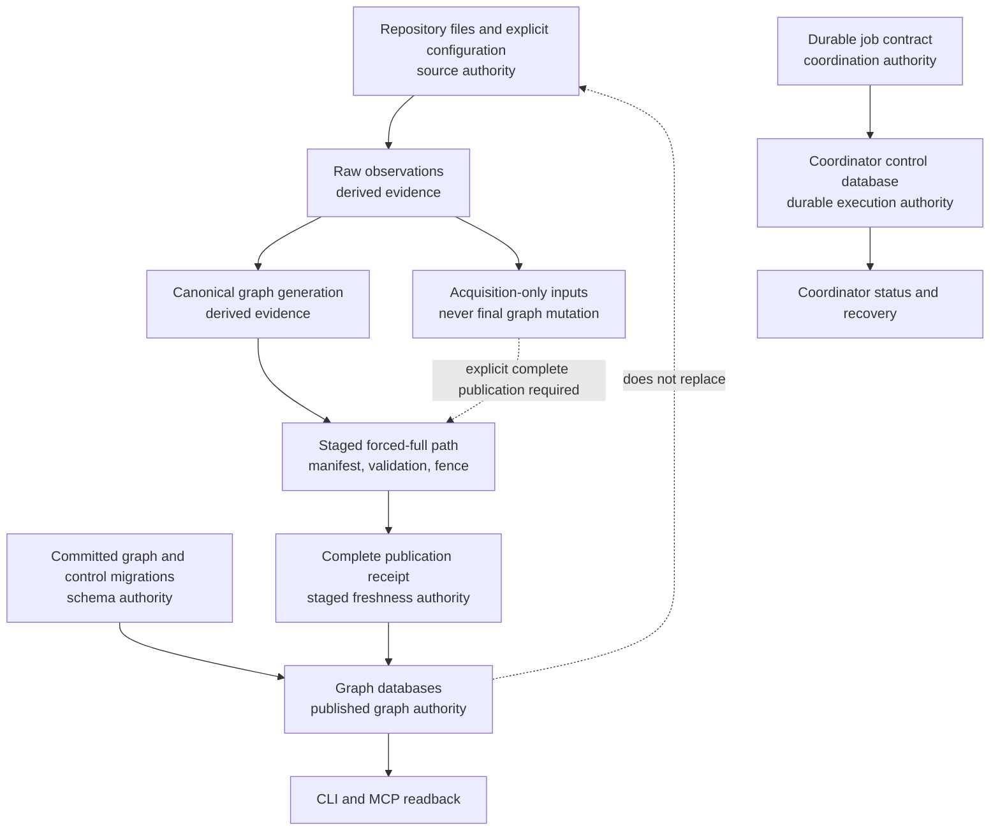

# RepoMap As-Built Architecture

Status: current normalized architecture index

Evidence baseline: ARCH-CLOSE over the accepted ARCH8 implementation

## Purpose and boundary

This document describes the architecture implemented by the committed RepoMap
source, migrations, and tests at the evidence baseline. It also compares that
implementation with accepted architecture decisions and phase records.

This document does not authorize production implementation, package changes,
schema changes, runtime changes, deployment changes, or a new supported
transport. Any change identified here requires a separately accepted phase.

This document is intentionally distinct from the long-term product direction.
[ADR 0057](../adr/2026/08/0057-cloud-first-multi-source-architecture-reconciliation.md)
establishes a cloud-first commercial destination, immediate multi-source graph
composition, and deployment-neutral target contracts. MS-ID1 implements the
additive identity/configuration foundation and MS-FLAKE2 adds the first local
vertical-slice candidate described below. The local
PostgreSQL system remains the current as-built authority, reference and
qualification implementation, contributor/power-user distribution, and
possible private/self-hosted deployment.

The architecture is local-first. RepoMap statically extracts observations from
configured source roots, canonicalizes those observations, publishes graph
state to exactly owned PostgreSQL databases, and exposes bounded readback
through its CLI and read-only MCP server. Canonical lists and embedded
neighborhood/evidence collections have deterministic limits and continuation
contracts. Direct refresh is the default execution mode. An explicit
local coordinator mode adds durable request state, bounded worker processes,
publication fencing, and recovery without replacing direct mode.

Each legacy configured graph still resolves one source root and one dedicated
graph database and projects deterministically to one compatibility binding.
An explicit graph may instead bind several local folders or Git working trees.
Its complete inventory is captured before extraction, resolved through the
current Python semantic path, and supplied once to the existing staged sole
publisher. STR-PUB5 selects portable snapshot manifests, extraction receipts,
and publication bundles for supported local forced-full production refresh.
The parent seals inputs and a supervised database-independent Python worker emits
untrusted candidate evidence. STR-WORK4-FIX1 adds real managed-
subprocess parity, deterministic replay/conflict evidence, a runtime capability guard,
and a non-authoritative `stage-unassigned` row placeholder. STR-WORK4-FIX2 completes
the local typed-terminal, receipt-unavailable, deterministic cancellation, behavioral
authority, exact cleanup, caller-root isolation, replay/conflict, and versioned
stage-row matrices. The existing sole publisher validates current bundles,
generates physical stage identity, loads and validates all seven families, and
atomically binds the final portable receipt. No hosted control plane is implemented.

## Evidence and authority rules

The following order governs statements in this document:

1. Committed production source and migrations define implemented behavior.
2. Committed tests define proved contracts and intended failure behavior.
3. Accepted ADRs and specifications define documented intent.
4. Accepted status records provide historical phase and operational evidence;
   they do not override later source.
5. Generated graph databases and private runtime state are evidence, not source
   of truth, and are not used as architectural authority here.

When accepted intent and committed implementation differ, this document labels
the difference. It does not silently project the intent onto the implementation.
No live runtime, graph, container, or protected-repository operation was used to
establish this baseline. Operational claims are limited to committed status
records and committed tests.

Primary intent records are:

- `docs/adr/2026/07/0031-permanent-local-repomap-mcp-operations.md`
- `docs/adr/2026/07/0032-containerized-local-runtime-and-config-home.md`
- `docs/adr/2026/07/0033-backup-first-database-lifecycle.md`
- `docs/adr/2026/07/0037-psycopg-runtime-dependency-candidate.md`
- `docs/adr/2026/07/0038-local-operations-and-canonical-readback-architecture.md`
- `docs/adr/2026/07/0039-synchronous-and-asynchronous-architecture.md`
- `docs/adr/2026/07/0040-high-scale-full-refresh-ingestion.md`
- `docs/specs/durable-job-and-coordinator-contract.md`
- `docs/specs/storage-model.md`

## Historical normalization progression

The ARCH1A through ARCH1C subsections preserve the intermediate contracts that
opened the normalization sequence. They are historical phase evidence, not the
ARCH-CLOSE current-state registry. Later sections in this document and the
intended-versus-implemented matrix state the accepted final behavior.

### ARCH1A authority normalization update

ARCH1A preserves the ARCH0 data model and writer behavior while replacing
ambiguous internal freshness selection with three explicit concepts:

- latest recorded run: the highest recorded run regardless of terminal state
  or receipt;
- latest successful import: the highest complete receiptless compatibility
  import; and
- latest receipt-bearing publication: the highest complete run with every
  publication receipt field present.

`repomap_kg.storage.authority` owns typed request, operation, job, attempt,
graph-run, and stage identities; the shared publication-generation tuple; and
closed refresh and publication result vocabularies. `storage/run_authority.py`
owns typed readback records and the standard SQL projection. Status, graph and
storage summaries, baseline/drift inputs, and publication reconciliation now
request an explicit authority concept. Existing `latest_run_*` JSON, table,
record, and coordinator marker fields remain compatibility projections of the
latest recorded run or latest receipt-bearing publication as appropriate.

No schema, migration, writer, row-wise command, lifecycle, or canonical graph
behavior changes in ARCH1A. Receiptless imports remain an active transitional
final-state mutation path and therefore keep `ARCH0-AUTH-002` in progress.

### ARCH1B topology and repository authority update

ARCH1B adds one pure resolved configuration contract in
`repomap_kg.ops.resolved_config`. It resolves every configured graph database,
derives a distinct control database, keeps the `postgres` maintenance target
outside product ownership, and rejects duplicate effective graph databases,
template or maintenance targets, control collisions, and configured repository
identity collisions. The exact private ownership projection is the sorted set
of graph and control databases; it excludes the maintenance target.

The stable configured repository identity is `repo1:<graph-id>`. It is derived
from graph registration rather than source root, so moving a checkout retains
the configured identity. Changing the graph ID is re-registration and requires
an explicit compatibility or migration decision. A root move still changes the
configuration generation because the current execution contract includes the
resolved source location.

Configuration loading, direct refresh generation, coordinator generation,
runtime/service planning, graph status, and lifecycle ownership projection use
the same resolved model. Existing configuration keys and public result shapes
remain compatible. ARCH5C1 additively introduces a nullable
`repository_identity` column and partial uniqueness contract after verified
backup, while preserving existing rows and root-path-keyed writer behavior.
ARCH5C2A populates identity and reconciles relocated rows. ARCH5C2B derives the
same identity at configured refresh, resolves staged writes through the partial
unique identity index, and updates mutable name/root metadata. Historical
callers that omit identity retain root-keyed behavior. ARCH5C3 proves
migration-only baseline/drift invariance, restores the pre-identity row from a
portable logical backup, and forward-reconstructs the stable post-refresh
baseline without drift. ARCH5D refuses destructive advancement while any
repository identity remains null, then drops the six legacy staging/final
relations in foreign-key-safe order. File/raw/canonical authority and
source-backed compatibility readback remain unchanged; historical migrations
remain intact.

### MS-ID1 source and candidate identity update

MS-ID1 adds four distinct, deployment-neutral domain records under
`repomap_kg.graph.multi_source`: source definition (`src1:`), graph-source
binding (`bind1:`), immutable source snapshot (`snap1:`), and unaccepted graph
candidate (`cand1:`). Canonical SHA-256 framing also versions source-selection,
selected-content manifest, multi-source configuration, and candidate inputs.
The contracts use closed ASCII grammars, byte bounds, canonical ordering,
duplicate refusal, and unknown-version refusal. Physical roots, mounts,
database names, containers, regions, and source bytes are not identity inputs.

The operations TOML schema remains version 1. Legacy `root_path`,
`repository_name`, `privacy`, `extractor_profile`, and `exclude_paths` continue
to load unchanged and project to one relocation-stable compatibility binding.
The MS-ID1-FIX1 correction candidate preserves predecessor-accepted uppercase,
underscore, spaced, or otherwise non-token extractor profiles and duplicate,
Unicode, long, or literal-dot excludes. Strict-valid profiles pass through;
other profiles use a bounded `legacy-<sha256-prefix>` binding token. A separate
legacy `select1:` digest binds the exact ordered exclude strings when they do
not satisfy the explicit selection grammar. Raw legacy fields remain visible
in their existing graph configuration fields, so the encoded binding identity
does not retroactively redefine the legacy grammar.

The MS-ID1-FIX2 candidate makes the two compatibility distinctions explicit.
Legacy exclusions conditionally use the fallback `select1:repomap-legacy-source-selection-v1`
domain to preserve order and duplicates when they do not satisfy strict grammar;
explicit binding selections are duplicate-free and canonicalized before their
strict-domain digest. The exact `legacy-<32hex>` derived profile shape and
for compatibility projection. Explicit binding syntax refuses those reserved
forms, while legacy input using either form remains accepted and is escaped
deterministically. Other strict-valid legacy profiles remain passthrough values.
New explicit inventories use `[[graphs.source_bindings]]`; mixing those tables
with legacy graph-source fields is ambiguous and rejected. This name is
deliberately distinct from the existing top-level `[sources]` acquisition
placeholder registry. Binding IDs and aliases are graph-local and unique;
reusing one source-definition ID with conflicting kinds is rejected.

The resolved configuration carries the ordered binding inventory and its
`msc1:` configuration identity. Explicit archive, authorized-remote, or
disabled single bindings are representable but cannot enter current refresh.
Several bindings cannot be MCP-visible and cannot enter direct or coordinator
refresh. Runtime source-mount projection includes every enabled binding rather
than silently selecting the first.

The MS-ID1-FIX1 correction candidate preserves unsupported worker refresh as a
non-retryable configuration terminal with its sanitized source classification;
generation changes retain the distinct generation-change terminal. Aggregate
status projects multi-binding graphs as `[multi-source]` with
`multi-source-readback-unsupported` and no binding-specific database facts.
Graph-specific summary, canonical-file, stored-baseline, drift, and MCP paths
refuse with the same classification before database access. The internal
first-binding projection is removed by the MS-ID1-FIX2 candidate: a graph with
several bindings has empty graph root, extractor, and selection fields, uses
`[multi-source]` as its repository display, and is graph-private unless every
binding is public. Binding-owned values remain only in their binding records.
The exact PostgreSQL integration selector was refused before collection on
both permitted FIX2 executions, so this paragraph records a local candidate
rather than completed integration evidence.

Configuration is the durable source-definition and binding authority for this
additive step. Snapshots and candidates are executable content identities for
later producers; they are not accepted publications and add no PostgreSQL rows
or writer. Graph key version 1, repository identity, current graph rows,
publication receipts, generation fencing, `commit_unknown` reconciliation,
cleanup, quarantine, and readiness remain unchanged.

### MS-FLAKE2 modular-flake vertical-slice update

The MS-FLAKE2 candidate admits only enabled explicit `folder` and
`git-working-tree` bindings. Stable binding ID determines capture order. Each
binding is discovered into an exact selected-content manifest and one
`snap1:` identity. Hash, size, and executable state come from one stable file
descriptor read, semantic extraction uses a temporary immutable copy, and one
final whole-inventory pass after extraction and resolution detects changes to
any binding. Local roots are locators only. Folder relocation does not
change snapshots, candidate identity, source-local keys, or accepted metadata.
For Git working trees this slice binds the exact selected clean or dirty bytes
with `git_commit` and `git_tree` unset rather than claiming a repository-object
identity it did not prove.

Explicit-binding observations use `<binding-alias>/<relative-path>` inside the
existing graph-key-v1 path grammar. This namespace applies at one explicit
binding, so adding a second binding cannot re-key the first; aliases cannot
contain `/`, so the prefix boundary is unambiguous. Legacy graph syntax does
not enter this pipeline and retains its unqualified keys and public file path.
Raw and canonical file metadata carries binding ID, alias, role, snapshot ID,
source-relative path, and candidate ID. Enumerating records for that candidate
recovers the participating binding/snapshot set without copying one binding's
metadata into another binding's file record.

The Nix extractor emits literal input references for the resolver described in
`nix-cross-source-resolution.md` plus source-qualified literal
`nixosModules` output-to-path mappings. Only explicit static mappings to a
selected target can make a cross-binding reference exact; bare input and
filename convention are non-exact. Ambiguous, conflicting,
evaluation-dependent, and unsupported outcomes remain bounded evidence with
opaque per-observation unknown/dynamic targets and never receive source-order
precedence or merge unrelated scalar provenance.

Every multi-source observation must carry binding ID, alias, role, revision,
snapshot, and source-relative provenance consistent with the bound inventory;
path prefix parsing is not an authority. The completed observation set is
spooled once and passed to the existing seven
staging families and existing publication handoff. Candidate identity is
included in every observation and itself binds the complete vector, so the
receipt's source generation binds the ordered snapshot vector. Its config
generation separately binds the role/input map, resolver, extractor capability,
canonicalizer, semantic contract, and quality rules. Cheap coordinator and
worker scans derive these same fences without semantic capture; execution's
single full capture must match them. The unchanged four-field generation tuple, graph
lease/singleton fencing, one transaction, final-row replacement,
`commit_unknown` reconciliation, and retry-stable stage ID remain publication
authority. No source or binding writes accepted rows independently.

Configured multi-source readback uses `graph:<graph-id>`, matching publication,
and graph-file SQL projects binding/snapshot/candidate provenance. Effective
privacy is conservative: if any binding is non-public, every binding root and
expanded root is redacted from config/status/CLI/MCP output and included in MCP
private-path sanitization.

### ARCH1C publication exclusion update

ARCH1C gives forced-full staged publication one graph-local exclusion
invariant across direct and coordinator orchestration. Immediately before any
prepare or merge statement, both modes attempt the same graph-scoped advisory
transaction lock. Contention returns one bounded storage error without waiting
or mutating the stage, run, receipt, authority, or final graph rows.

A coordinator control claim now receives a graph-claim capability from its
PostgreSQL transaction identity. This ordering value is distinct from the
singleton fencing epoch and is carried unchanged through the private refresh
capability into storage. In the same transaction that creates the run and
stage, storage registers the exact claim in the existing
`graph_publication_authority` projection. A greater claim may replace an older
claim only when singleton authority does not regress; an equal claim is
idempotent only for the exact owner, generations, and stage. Final preparation
locks and revalidates that row before the unchanged merge and receipt
transaction.

No graph or control schema changes in ARCH1C. The distinct graph capability is
durable once graph-side registration commits. Control startup recovery does
not relaunch the old publication, so it reconstructs only the durable control
identity needed for receipt reconciliation or a new queued attempt. If a
future contract permits a recovered attempt to republish under its original
capability, ARCH5 must add a versioned, product-owned control migration before
that behavior is enabled.

## System context

RepoMap has three local interaction surfaces: the command-line interface, the
stdio MCP server, and a configuration- and storage-backed HTTP health/status
server. They share
configuration and storage contracts, but they are distinct entrypoints and do
not imply one another.

The system context is supported by `pyproject.toml`,
`src/main/python/repomap_kg/__main__.py`,
`src/main/python/repomap_kg/cli/main.py`,
`src/main/python/repomap_kg/server/mcp.py`, and
`src/main/python/repomap_kg/server/http.py`. Entrypoint coverage includes
`src/test/unit/python/repomap_kg/cli/local_ops/mcp_serve.unit.test.py` and
`src/test/int/python/repomap_kg/cli/server_entrypoint.int.test.py`.

## Deployment units and current process model

The codebase contains five primary product/orchestration process roles plus one
optional controlled extraction child process:

- a direct CLI process;
- a foreground coordinator process;
- bounded refresh worker subprocesses created by the coordinator;
- a read-only stdio MCP process;
- a configuration- and storage-readiness HTTP health/status process; and
- the versioned Go helper subprocess when Go extraction is enabled.

PostgreSQL is the durable storage service. The generated local Compose model
currently deploys only PostgreSQL and the HTTP health/status process. It does
not deploy the stdio MCP process, the coordinator, or a coordinator-control
initialization job.

`src/main/python/repomap_kg/runtime/commands.py::render_compose_yaml` creates
the current two-service topology. Its RepoMap service runs `server serve`, and
`src/main/python/repomap_kg/server/http.py::RepoMapLocalRequestHandler`
implements `GET /livez`, `GET /healthz`, `GET /readyz`, and `GET /status`. On the
main thread, `serve_local_http` handles `SIGTERM` gracefully by closing the server
and exiting 0. It has no MCP request method.
`src/main/python/repomap_kg/server/mcp.py::serve_stdio` is the implemented MCP
transport.

The current runtime behavior is covered by:

- `src/test/unit/python/repomap_kg/runtime/local_runtime.unit.test.py`
- `src/test/int/python/repomap_kg/cli/local_runtime.int.test.py`
- `src/test/unit/python/repomap_kg/server/local_server.unit.test.py`
- `src/test/unit/python/repomap_kg/mcp_server/schemas_jsonrpc.unit.test.py`

## Product and internal entrypoints

The installed Python product has one console script:

- `repomap-kg`, declared in `pyproject.toml` as
  `repomap_kg.cli:main`.

Equivalent or specialized module entrypoints are:

- `python -m repomap_kg`, implemented by
  `src/main/python/repomap_kg/__main__.py`;
- `repomap-kg mcp serve`, which delegates to the stdio MCP server;
- `python -m repomap_kg.server.mcp`, which also starts stdio MCP;
- `repomap-kg server serve`, which starts HTTP health/status;
- `repomap-kg ops refresh-graph --mode direct`, the default refresh mode;
- `repomap-kg ops refresh-graph --mode coordinator`, the explicit durable
  coordinator client mode;
- `repomap-kg ops coordinator-serve`, the portable foreground coordinator;
- `repomap-kg local ...`, the generated local-runtime and database-lifecycle
  command family;
- `repomap-kg storage load-files`, a receipt-bearing staged publication command;
  and
- `repomap-kg sources ingest-feed`, `sources import-archive`, `sources
  import-warc`, `bulk import`, `api acquire`, and `github acquire`, versioned
  acquisition-only commands that cannot mutate final graph state or freshness.

`src/main/go/cmd/repomap-go-extract/main.go` is an internal helper executable,
not a second user-facing RepoMap product. Python resolves it only through the
controlled contract in
`src/main/python/repomap_kg/extractors/languages/go_helper.py` and invokes it
through `src/main/python/repomap_kg/extractors/languages/go_protocol.py`.

## Public and quasi-public contract inventory

This is the as-built contract registry. Parser/schema modules remain the exact
argument and field authority; the registry groups related commands without
inventing a common envelope that source does not implement.

| Surface | Current names | Argument and result contract | Exit/error contract | Evidence and classification |
| --- | --- | --- | --- | --- |
| Installed entrypoint | `repomap-kg`; equivalent `python -m repomap_kg` | `argparse` command tree; table/text by default and `--json` on supported commands | Dispatch returns `0` on success and `1` on handled validation/operation/storage failure; parser usage errors use the standard `argparse` exit | `pyproject.toml`; `repomap_kg/__main__.py`; `cli/parser.py`; `cli/dispatch.py`; current authoritative product entrypoint |
| Static source inspection | `discover`, `files`, `entrypoints`, `host-mutators`, `host-mutators-summary`, `identity`, `observations normalize` | Root/profile/filter or JSONL arguments are command-specific; these commands read or transform source artifacts without PostgreSQL publication | Bounded diagnostics through CLI; no target code execution authority | `cli/parser.py`; extractor/discovery tests; current product commands |
| Source planning | `bulk plan`, `api plan`, `github plan` | Required source configuration plus JSON/table plan projection; plans do not acquire or publish | Policy/configuration errors return handled failure | `cli/parser.py`; `cli/source_commands.py`; current read-only planning surfaces |
| Complete-generation publication | `storage load-files` | JSONL path, repository name, root path, optional commit, storage selector, and optional JSON summary; the command derives complete generations and uses the receipt-bearing staged publication transaction | Handled observation/storage error is `1`; success is `0` | `cli/storage_parser.py`; `ops/direct_publication.py`; staged-publication tests; current final graph mutation authority |
| Source acquisition | `sources ingest-feed`, `sources import-archive`, `sources import-warc`, `bulk import`, `api acquire`, `github acquire` | Required source configuration and local input plus JSON/table acquisition result schema version 1; mutation-only repository and PostgreSQL selectors are absent; `graph_mutated=false` and `freshness_updated=false` | Policy/acquisition error is `1`; success is `0`; no storage mutation is attempted | `cli/parser.py`; `cli/source_commands.py`; `ops/ingestion/`; current acquisition-only surface |
| Configured refresh and reads | `ops config-check`, `graphs`, `refresh-graph`, `refresh-preflight`, `refresh-enabled`, `refresh-status`, `graph-summary`, `graph-files`, `graph-baseline`, `baseline-save`, `baseline-prune`, `drift-check`, `policy-dogfood` | RepoMap home/config plus graph selector; refresh mode is `direct` or explicit `coordinator`; read filters, bounds, confirmation, baseline paths, and JSON/table results are command-specific | No silent mode/connector fallback; handled errors are `1`; drift is represented in result vocabulary rather than a separate universal exit schema | `cli/parser.py`; `cli/dispatch.py`; `ops/`; mixed mutation, readback, and baseline lifecycle contracts |
| Coordinator operations | `ops coordinator-serve`; `coordinator-service install/status/start/stop/restart/upgrade/uninstall/render/validate`; `coordinator-health`; `coordinator-control-status`; `coordinator-control-init`; `coordinator-job-status`; `coordinator-job-wait`; `coordinator-job-cancel`; `coordinator-jobs` | Exact RepoMap home, bounded wait/list controls, job identity, and optional JSON; service render is non-mutating while other actions have explicit lifecycle semantics | Auth/schema/ownership/state failures are closed protocol or CLI errors; no direct-mode fallback | `cli/parser.py`; `coordinator/`; `service_package/`; current durable orchestration and lifecycle surfaces |
| Server-memory reads | `ops server-memory-summary`, `ops server-memory-search` | Configured source, query/kind, limit/offset, JSON/table; read-only | Bounded validation/operation failure | `cli/parser.py`; `server/memory_bridge.py`; current optional read-only integration |
| Storage graph reads | `storage nodes`, `edges`, `neighborhood`, `file-neighborhood`, `host-mutators`, `host-mutators-summary`, and canonical explanation operations | Canonical-only vocabulary; public lists and embedded neighborhood/evidence collections use schema-version 1 envelopes, deterministic ordering, independent limit/offset windows, defaults of 50, and maxima of 200; bounded legacy-shape aliases do not restore removed graph semantics | Storage/schema or invalid-window error is `1`; successful truncation returns continuation metadata | `cli/storage_parser.py`; storage readback dispatch; ARCH5E and ARCH7A tests; current bounded canonical API |
| Storage summaries | `storage summary`, `ruby-summary`, `js-summary`, `js-framework-summary`, `openapi-summary`, `terraform-summary`, `python-summary`, `nix-summary`, `email-summary`, `bulk-summary`, `api-summary` | Root and connector selection plus JSON/table; `summary --legacy` exposes compatibility fields | Shape validation and handled storage failure | `cli/storage_parser.py`; `cli/storage_summary_commands.py`; current derived readback contracts |
| Local runtime/lifecycle | `local setup`, `up`, `down`, `status`; `local db dump`, `dump-all`, `restore-all`, `backups`, `backup-info`, `backup-inspect`, `init`, `drop` | Exact RepoMap home/runtime selector and resolved graph/control target allowlist; dry-run/confirmation; init source/dump choice; backup identity; optional JSON. `dump-all` captures the exact resolved graph/control ownership set; `restore-all` requires the matching stable complete set and empty topology | Lifecycle refuses unrelated safe names before external access; destructive drop requires `--backup-first` and confirmation; coordinated capture holds stable exclusion; coordinated restore verifies every checksum and target before mutation, restores control last, and cleans invocation-created targets after failure | `cli/_local_dispatch.py`; `coordinator/local_lifecycle.py::maintenance_window_for_coordinated_backup`; `runtime/backup.py::dump_all_databases`; `runtime/backup_restore_sets.py`; current CLI-owned coordinated backup/restore authority |
| MCP transport | `mcp serve` and `python -m repomap_kg.server.mcp` | MCP protocol `2024-11-05`; newline-delimited JSON-RPC over stdio; `tools/list` and `tools/call`; result contains text plus `structuredContent` | Schema rejects unknown methods, tools, fields, and invalid bounds; mutation/lifecycle tools are absent | `server/mcp.py`; `server/mcp_schemas.py`; current read-only transport |
| MCP tools | Project/status, canonical graph and explanation reads, source/feed reads, configured-graph reads, search and summary operations, refresh-status reads, and server-memory reads | Per-tool JSON Schema declares required fields, graph visibility, privacy projection, deterministic default/maximum limits, offsets, and collection-specific continuation metadata | Read-only; unknown tools/fields and invalid bounds fail closed; every list and embedded graph collection is bounded | `server/mcp.py::TOOL_FUNCTIONS`; `server/mcp_schemas.py::tool_definitions`; ARCH7A/ARCH7B tests; current bounded read-only API |
| HTTP health/status | `server serve`; `GET /livez`; `GET /healthz`; `GET /readyz`; `GET /status` | Schema-version 1 path-free JSON: process liveness, configuration health, storage readiness, required-schema readiness, bounded counts, and fixed safety metadata; no graph/repository/database identifiers or raw diagnostics | Local bind enforced unless explicit container-internal bind; failed health/readiness is HTTP 503, aggregate status is informational HTTP 200, unknown path is 404, graph probes cap at 200, and every response caps at 8 KiB | `server/http.py`; current bounded read-only status surface, not MCP |
| Coordinator client protocol | Local authenticated request/response schema version 1 over Unix socket or Windows loopback | Operation allowlist, typed payload, bounded error category, endpoint ownership and auth token | Unknown schema/operation or invalid ownership fails closed | `coordinator/transport.py`; `coordinator/client.py`; `coordinator/endpoint.py`; current internal/quasi-public service contract |
| Worker protocol | Version 1 JSONL message stream with job start, progress/result, cancellation, and worker exit; optional `portable_snapshot_v1` contract `1.0` with current explicit receipt-write status | Exact job/attempt/generation/capability/manifest identity; bounded subprocess argv and output; portable worker receives no database or target-source-root authority | Version, identity, ordering, cancellation, malformed-message, artifact, contract, authority, and receipt-write failures are explicit; every portable terminal remains `publication_state: not_started` | `coordinator/protocol.py`; `coordinator/refresh_worker.py`; `coordinator/portable_worker.py`; current internal contract |
| Go helper protocol | Protocol version 1 JSONL subprocess request/result | Explicit or package-local executable, separate argv, deterministic static extraction response; release images contain the selected Linux architecture helper at the controlled package path | Missing/mismatched helper or protocol fails closed; no ambient executable fallback | `extractors/languages/go_helper.py`; `extractors/languages/go_protocol.py`; `src/main/go/internal/protocol/protocol.go`; ARCH7F/ARCH8 packaging tests; current packaged internal contract |
| Service-package contract | `ops coordinator-service ...` | One portable foreground command rendered to launchd or systemd-user definition; owner-private environment and pre-resolved executable/database boundary | Install/start/upgrade/uninstall are explicit; render/validate are non-destructive | `service_package/contract.py`; `service_package/platforms.py`; current host adapter, not graph semantics |
| Configuration schema | Operations TOML schema version 1 plus one resolved authority model | RepoMap home, graph registry, optional graph-local source-binding inventory, PostgreSQL, profiles, privacy, refresh, runtime, service, server-memory, and credentials; every legacy graph projects one binding and every graph resolves one effective database | Unsupported/missing fields, ambiguous legacy/explicit sources, duplicate or colliding binding identities, unsupported multi-source readback/refresh, database collisions, and repository-identity collisions fail closed with bounded diagnostics | `ops/config.py::SUPPORTED_SCHEMA_VERSION`; `ops/resolved_config.py`; multi-source and resolver/projection tests; current exact topology authority |
| Baseline and drift schemas | Stored/preflight baseline JSON and drift result JSON/table | Baseline payloads reuse graph-summary/preflight shapes and accept historical wrapper forms; current payloads have no dedicated baseline/drift schema version | Explicit graph mismatch and invalid baseline errors; warning result represents detected drift | `ops/baselines.py`; `ops/baseline_operations.py`; current compatibility constraint requiring versioning before incompatible change |
| Graph/data identity versions | Graph key version 1; source/binding/snapshot/candidate identity version 1; raw observation schema version 1; stage manifest schema version 1 | Multi-source identities use distinct domains and canonical vectors; they do not re-key graph rows or imply publication acceptance | Unsupported versions, duplicate bindings, malformed manifests, and ambiguous source configuration fail closed at their owning boundary | `graph/keys.py::GRAPH_KEY_VERSION`; `graph/multi_source.py`; `observations/raw.py::SCHEMA_VERSION`; `storage/staged_ingestion.py`; current identity/schema authorities |

There is no single current JSON/result/error envelope across these surfaces.
CLI table output is presentation while JSON, MCP, coordinator, worker, Go,
configuration, baseline, drift, and HTTP payloads are separate machine
contracts. This separation is intentional at ARCH-CLOSE. Shared concepts have
one owner, public collections are bounded, privacy projections are allowlisted,
and any later incompatible change requires an announced versioned migration.

## Package layers

The implementation uses ordinary Python modules rather than a framework-level
service hierarchy. The committed production import graph is a DAG under the
repository-owned static AST guard; both the SCC allowlist and the
production-to-test-support exception allowlist are empty. Shared domain
contracts sit below extraction, storage, operations, platform adapters, and
presentation in that order. Compatibility facades may re-export same- or
lower-layer identities but cannot own decisions or create reverse edges. The
diagram below shows the current dominant dependency DAG; the repository-owned
package dependency matrix defines the exact allowed directions.

Representative boundaries are:

- distributed domain records: canonicalization, storage, coordinator, and
  operations contract modules rather than one owned domain package;
- CLI presentation: `src/main/python/repomap_kg/cli/`;
- MCP/HTTP presentation: `src/main/python/repomap_kg/server/mcp.py` and
  `src/main/python/repomap_kg/server/http.py`;
- operations: `src/main/python/repomap_kg/ops/`;
- coordination: `src/main/python/repomap_kg/coordinator/`;
- runtime: `src/main/python/repomap_kg/runtime/`;
- service packaging: `src/main/python/repomap_kg/service_package/`;
- extraction and discovery: `src/main/python/repomap_kg/extractors/` and
  `src/main/python/repomap_kg/graph/`;
- canonicalization: `src/main/python/repomap_kg/canonicalization/`;
- storage: `src/main/python/repomap_kg/storage/`;
- test support: `src/test/support/python/`;
- repository tools: `tools/`;
- graph migrations: `src/main/resources/rdbms/changelog.yaml`;
- control migrations:
  `src/main/resources/coordinator-rdbms/changelog.yaml` and
  `src/main/resources/coordinator-rdbms/2026/07/13-001-async2-create-control-schema.sql`.

ARCH1D through ARCH1I removed the six ARCH0 cyclic components across extractor
configuration, operations/runtime, CLI/server, coordinator internals,
discovery routing, and storage telemetry. ARCH1J moved the synthetic-worker
fixture target, support path, allowlist, and fixture-selecting factory into test
support. The static production SCC and production-to-test-support exception
allowlists are empty and enforced by the repository-owned AST guard.

## Configuration and credential flows

`src/main/python/repomap_kg/ops/config.py::resolve_repo_map_home` resolves the
configuration home from an explicit command argument, the `REPOMAP_HOME`
environment variable, or the platform default. The unified TOML configuration
describes enabled graphs, source roots, storage, service transport, and local
runtime values.

The generated container configuration uses the internal PostgreSQL service
name and projects the database password through the named password environment
variable. The native service-package path instead constructs a bounded
foreground command and removes ambient authority before launch. Its contract
pre-resolves the required `psql` executable and supports an owner-protected
credential file.

The generated release cluster implements distinct read/status,
refresh/publication, coordinator-control, and one-shot lifecycle-administrator
roles and secrets. Long-running HTTP, MCP, and coordinator units receive only
their required database capability. The bootstrap/lifecycle credential is
confined to one-shot initialization, upgrade, backup, restore, drop, and grant
reconciliation and is not projected into long-running units.

Relevant implementations are:

- `src/main/python/repomap_kg/ops/config.py`
- `src/main/python/repomap_kg/runtime/plan.py::default_repomap_rpl_toml`
- `src/main/python/repomap_kg/runtime/commands.py::render_compose_yaml`
- `src/main/python/repomap_kg/coordinator/configured_refresh.py`
- `src/main/python/repomap_kg/service_package/contract.py`
- `src/main/python/repomap_kg/service_package/environment.py`

Credential values must not enter images, committed configuration, generated
service definitions, logs, status responses, MCP payloads, or durable reports.
The release cluster projects allowlisted configuration and enabled source roots
read-only only into units that require them. Coordinator state and other
writable paths are narrowly owned. Private backup and lifecycle-admin state is
mounted only into the one-shot lifecycle boundary; HTTP and MCP cannot access
it. Enabled source roots use deterministic validated path projection rather
than a broad writable RepoMap-home mount.

ADR 0038 accepts one dedicated database per graph for destructive and backup
isolation. ARCH1B enforces unique effective graph databases, a distinct derived
control database, and a separate non-owned maintenance connection while
retaining documented global fallback. ARCH7C1 applies the resolved exact
graph/control allowlist to local lifecycle and coordinator maintenance
admission and uses the resolved maintenance target for database DDL. ARCH7C2
holds control and exact graph maintenance ownership continuously across
backup-first drop snapshot, verification, and destruction.

## Extraction, observations, and canonicalization

Extraction is static. RepoMap reads configured source files but does not
execute target project code, scripts, profiles, package managers, or generated
commands. Language-specific extractors produce bounded observations with
evidence. Normalization preserves explicit confidence and unsupported or
dynamic boundaries. Canonicalization derives deterministic identities, nodes,
edges, and provenance before storage publication.

The current refresh contract is forced-full. A refresh constructs a complete
replacement generation for the selected graph. It does not infer an
incremental result from partial source changes.

### Forced-full refresh sequence

The refresh pipeline is implemented in
`src/main/python/repomap_kg/ops/refresh.py`, while coordinator adaptation is in
`src/main/python/repomap_kg/coordinator/refresh_adapter.py` and
`src/main/python/repomap_kg/coordinator/_refresh_execution.py`. Go helper
resolution and bounded protocol behavior are covered by:

- `src/test/unit/python/repomap_kg/extractors/languages/go_protocol.unit.test.py`
- `src/test/unit/python/repomap_kg/extractors/languages/golang.unit.test.py`
- `src/test/unit/python/tools/go_helper_build.unit.test.py`

The accepted Go source/protocol closure is recorded in
`docs/status/2026/07/12/00469-go23-go-epic-closure.md`. ARCH7F completes the Linux
container release boundary by building the selected arm64/amd64 executable in
a pinned builder stage and installing it at the controlled package-local path.

## Storage and publication

PostgreSQL owns normalized persistent graph state. The current production
forced-full refresh path uses staged ingestion through Psycopg: bulk transfer
populates staging state, set-based merge constructs the replacement, a
publication fence protects the graph generation, and a final transaction
publishes the new generation. Migration and destructive lifecycle operations
retain their explicit `psql` ownership.

Receipt-bearing staged publication is the only supported final graph mutation
path. `storage load-files`, configured refresh, and the supported programmatic
complete-generation adapter share that authority. Feed, archive, WARC, bulk,
API, and GitHub surfaces are versioned acquisition-only operations and cannot
update final graph state or freshness. The former canonical-only command,
row-wise writer primitives, legacy proposal/staging families, and legacy final
graph writes are absent from current production source.

### Direct-mode publication sequence

Direct mode is the default and recovery path. It runs refresh in the initiating
CLI process and reports failure directly; it does not silently submit work to
the coordinator.

The path is implemented by
`src/main/python/repomap_kg/storage/staged_ingestion.py::run_staged_full_refresh`
and `src/main/python/repomap_kg/storage/staged_publication.py`. Integration
coverage includes
`src/test/int/python/repomap_kg/storage/scale8_staged_ingestion.int.test.py`.
The staged-production closure is recorded in
`docs/status/2026/07/14/00545-scale8-production-staged-ingestion.md`.

This sequence describes `ops refresh-graph`. It does not describe the active
row-wise storage and source-import commands listed above.

### Coordinator-backed publication sequence

Coordinator mode is explicit. The client authenticates to the local
coordinator, submits an idempotent request, and waits for terminal durable
state. The coordinator owns queue state and leases, while a bounded child
worker owns one refresh execution. The worker uses a versioned JSONL protocol;
it does not replace the graph-storage contract.

Key source and test evidence is:

- `src/main/python/repomap_kg/coordinator/local_mode.py`
- `src/main/python/repomap_kg/coordinator/_worker_launch.py`
- `src/main/python/repomap_kg/coordinator/refresh_worker.py`
- `src/test/unit/python/repomap_kg/coordinator/local_mode.unit.test.py`
- `src/test/int/python/repomap_kg/coordinator/local_mode.int.test.py`
- `src/test/int/python/repomap_kg/coordinator/local_lifecycle.int.test.py`
- `docs/status/2026/07/13/00523-async9-explicit-local-coordinator-mode.md`
- `docs/status/2026/07/14/00535-async-close-durable-coordinator-architecture.md`

## Failure and recovery

RepoMap fails closed at authority boundaries:

- missing or incompatible coordinator control schema blocks coordinator start;
- coordinator-control initialization is explicit and is not performed by
  foreground service startup;
- a missing Go helper fails extraction rather than selecting an implicit
  alternative implementation;
- coordinator connection failure does not invoke service installation or
  silently run direct mode;
- cancellation and worker failure are reconciled against durable control and
  publication state;
- destructive database operations require their documented backup-first
  preconditions.

A lost connection during final publication can make the client-side commit
outcome unknown. `src/main/python/repomap_kg/storage/staged_publication.py::reconcile_commit_unknown`
reconnects and reads authoritative publication markers rather than blindly
repeating the final mutation.

### Commit-unknown recovery sequence

Publication reconciliation evidence includes
`docs/status/2026/07/14/00542-scale5-publication-fencing-reconciliation.md` and
`src/test/int/python/repomap_kg/storage/scale8_staged_ingestion.int.test.py`.
Coordinator control lifecycle behavior is recorded in
`docs/status/2026/07/13/00524-async10-control-database-lifecycle.md`.

The implemented commit-unknown path does not convert an absent receipt into a
safe failure. A matching receipt resolves success; a conflicting receipt raises
and quarantines the state; absence or insufficient evidence remains
`commit_unknown`/reconciliation-required for operator action. A proved rollback
before publication begins is a separate failure path.

## Readback and read-only MCP

Canonical and operational readback is adapter-backed. The current default
database connector is Psycopg, with explicit Psycopg and `psql` selector paths
retained where supported. Query construction, payload shape validation,
redaction, and tool-specific presentation bounds remain outside the connector.

Relevant source and parity evidence includes:

- `src/main/python/repomap_kg/storage/readback_driver.py`
- `src/main/python/repomap_kg/storage/canonical.py`
- `src/main/python/repomap_kg/storage/legacy.py`
- `src/main/python/repomap_kg/ops/readback.py`
- `src/test/unit/python/repomap_kg/storage/readback_driver/driver_selection.unit.test.py`
- `src/test/unit/python/repomap_kg/storage/readback_driver/connector_selection.unit.test.py`
- `src/test/int/python/repomap_kg/storage/psycopg_parity/summary.int.test.py`
- `docs/status/2026/07/12/00444-psycopg110-connector-readback-closure.md`

MCP dispatch is read-only. It may inspect configured and stored state, but it
does not refresh graphs, initialize or migrate databases, restore or drop
databases, install services, or mutate source roots.

### Read-only MCP flow

`src/test/int/python/repomap_kg/storage/mcp_ops_live/read_only_tools.int.test.py`
and `src/test/unit/python/repomap_kg/mcp_server/status_and_raw_payload.unit.test.py`
cover this boundary. The HTTP service is not an MCP transport.

## Lifecycle authority

Lifecycle ownership is intentionally separated from long-running read and
coordination processes. CLI commands own setup, runtime up/down/status, backup,
inspection, restore, fresh-database initialization, and backup-first drop
flows. Coordinator-control initialization is also explicit. The coordinator
serve path checks its schema and never initializes it implicitly. Stopping the
generated local runtime preserves persistent storage unless an explicit later
operation changes that state.

The product does not yet implement complete graph and control upgrade
authority. ARCH5A1 makes graph initialization use a
product-owned ordered, checksummed applied-migration ledger. Pending graph DDL
and ledger rows commit in one transaction, exact-current replay is a no-op,
and unmanaged or divergent non-empty schemas fail closed. `local db init
--from-source` still rejects an existing target. `local db upgrade-schema`
adopts an existing graph database only after a verified restorable backup and
exact catalog equality with a freshly initialized disposable reference. It
then applies a ledger-only transaction and verifies the complete ordered
ledger without replaying historical DDL. ARCH5A3 applies equivalent authority
to the coordinator-control database. Fresh initialization commits historical
control DDL and the ordered checksummed ledger together; exact-current replay
is idempotent; and verified backup-first adoption accepts only exact catalog
equality with a fresh disposable reference before ledger-only bootstrap.
ARCH5A4A adds one control-database advisory-lock authority for coordinator
maintenance: submission, automatic coalescing, and claims fail closed while an
exclusive owner is queued or held; existing workers retain shared ownership
through their complete lifecycle and drain before exclusive acquisition; and
configured coordinator health reports schema maintenance as not ready while
preserving service liveness. ARCH5A4B completes the cross-plane boundary.
Staged graph publication/import holds graph-local shared ownership through
commit-unknown reconciliation; configured direct commands also hold control
ownership; graph upgrade owns control then its target graph; and control
upgrade owns control then every configured graph in deterministic order before
backup through cleanup. ARCH5B adds deterministic fresh-target recovery.

Fresh graph initialization and dump restore create the target database before
applying source SQL or running `pg_restore`. The database created by the
current invocation is provisional until the exact ordered checksummed graph
migration ledger is verified. Schema, restore, or readiness failure removes
that created target before returning, so retry starts from an absent target.
An existing graph target remains refused without inspection, repair, drop, or
adoption. Control initialization applies its transactional migration SQL only
to a database created by the current invocation, removes that database after
initialization or readiness failure, and treats an existing target as
idempotent only when it is already exact-current. Existing empty, partial, and
divergent control state remains unrecognized and unchanged. ARCH5C1 extends
graph upgrade authority to an exact nonempty ledger prefix: after verified
backup it applies the authoritative pending DDL and ledger suffix in one
transaction and verifies exact-current state. Exact-current and diverged
managed ledgers fail closed before backup.

`local db dump-all` and `local db restore-all` now own the complete resolved
graph/control backup contract. Capture excludes the maintenance database and
publishes one stable atomic set. Restore requires the exact current ownership
tuple and empty topology, restores control last, and reverses only targets
created by its invocation after failure.

Container ownership is not database ownership. `local db drop` therefore
admits only an exact member of the resolved graph/control ownership set before
container, backup, lock, or destructive access. It also requires a verified
backup, explicit confirmation, a safe PostgreSQL identifier, and a
RepoMap-labeled container. ARCH7C2 wraps confirmed, non-dry-run backup-first drop in the existing
cross-plane maintenance authority before recovery-point capture. A graph drop
holds control plus that exact graph; a control drop holds control plus every
configured graph in deterministic order. The window remains held through dump,
backup verification, backend termination, and destruction and releases on
failure. Dry-run and precondition-refusal paths remain non-locking.

ARCH7D1 streams `pg_dump` stdout directly into a private staging file and passes
the verified dump file as `pg_restore` stdin. It computes size and checksum in
bounded chunks, uses explicit `0700` backup-directory and `0600` artifact
modes, flushes completed artifacts, and atomically renames one hidden staging
directory to the final set only after dump, manifest, and restore note
completion. Pre-publication failure removes the complete staging directory.
Backup enumeration ignores orphaned hidden staging sets, and explicit restore
resolution refuses their manifests. Manifest format version 1 and existing
published single-target readback remain unchanged. Restore intentionally omits
owner and privilege metadata, so a future role-separated cluster must
re-provision roles/grants declaratively after init, upgrade, and restore.

ARCH7D2 resolves the complete graph/control ownership tuple and uses it for the
`dump-all` plan, ordered subprocess sequence, manifest database order, dump
names, and checksums. A real CLI operation holds the coordinator's control-then-
all-graphs maintenance exclusion through atomic publication and records that
bounded stable-point assertion in the existing version-1 manifest. Dry-run
does not connect or lock. A failed intermediate dump removes the entire hidden
set and publishes no manifest.

ARCH7D3 adds `local db restore-all` for only that stable complete-set contract.
It requires the manifest's exact current graph/control database tuple, stable
recovery-point assertion, and exactly one unique checksummed dump for every
owned database. Every checksum is verified before runtime inspection, and
every target is proven absent before the first create. Configured graph
databases restore in sorted order; coordinator control restores last so control
state is not published over an incomplete graph topology. Any failed attempt
removes all databases created by that invocation in reverse order. Cleanup
failure is explicit and bounded. The operation does not overwrite, merge,
remap, or partially restore a set.

ARCH7E defines four database capability classes. The configured bootstrap
account is retained only for one-shot lifecycle administration. Generated
read/status, refresh/publication, and coordinator-control login roles receive
distinct private secrets and deterministic idempotent grants. Read/status can
select graph and control state. Refresh/publication can mutate graph databases
but cannot connect to control. Coordinator-control can mutate control but
cannot connect to graph databases. Public defaults are revoked, and default
privileges preserve the matrix for lifecycle-owned future objects.

Fresh graph init, single-dump restore, graph upgrade, control init/upgrade, and
coordinated restore reconcile roles after schema work and inside the existing
cleanup boundary where one exists. HTTP and MCP config loading projects the
parsed configuration onto read/status. The foreground coordinator uses the
control role for its durable store and passes the refresh role through its
private worker capability. It does not load the lifecycle-administrator secret
or receive maintenance-database authority.

Fresh database creation uses bare `CREATE DATABASE` and inherits template
encoding/collation; Compose declares no initdb locale/encoding. Text-key and
path ordering queries do not consistently declare a collation, so public order
or merge tie-break behavior can vary across cluster locale. A release contract
must declare compatible encoding/collation or explicit byte-stable ordering.

The authority contract is documented by
`docs/adr/2026/07/0033-backup-first-database-lifecycle.md` and
`docs/adr/2026/07/0038-local-operations-and-canonical-readback-architecture.md`.
Implementations include `src/main/python/repomap_kg/cli/_local_parser.py`,
`src/main/python/repomap_kg/runtime/local.py`, and
`src/main/python/repomap_kg/coordinator/local_lifecycle.py`.

## Storage and data authority

Repository files, committed configuration, migrations, fixtures, and accepted
contracts are source authority. Raw observations and canonical records are
derived evidence. PostgreSQL is authoritative for current final graph state and
durable coordinator state, but it does not replace the underlying repository as
source of truth. Latest recorded execution and latest published graph are
distinct typed concepts. Only a complete receipt-bearing staged transaction can
advance published graph freshness.

The graph migration chain is rooted at
`src/main/resources/rdbms/changelog.yaml`. The coordinator schema is rooted at
`src/main/resources/coordinator-rdbms/changelog.yaml`, including
`src/main/resources/coordinator-rdbms/2026/07/13-001-async2-create-control-schema.sql`.
Database dumps, generated graphs, runtime state, credentials, and private source
payloads are not repository artifacts.

Repository-row identity does not yet satisfy the accepted relocation contract.
ARCH5C1 adds nullable `repositories.repository_identity` with partial
uniqueness, while retaining `repositories.root_path` as private mutable source
location. ARCH5C2A resolves the target database back to exactly one configured
graph, retains a verified backup, and reconciles path-keyed rows into the
configured-root survivor. Historical run-scoped rows remain, overlapping final
identities collapse deterministically, canonical links and staging ownership
are remapped, and the highest publication authority survives. ARCH5C2B cuts
configured staged writes over to `repository_identity`, so root relocation
updates mutable metadata without changing repository ID. Retained direct and
row-wise adapters accept optional identity while omission preserves historical
`root_path` conflict behavior.

## Privacy and security boundaries

The implemented and accepted architecture establishes these boundaries:

- target repository code is inspected statically and is not executed;
- MCP is read-only and applies redaction; canonical lists, neighborhoods, and
  explanations have versioned bounded collections;
- local network services are intended for local exposure only;
- the generated HTTP server may bind on the container interface only through
  its explicit container-internal mode, with host publication remaining local;
- coordinator clients use an authenticated local transport, and workers receive
  bounded capability rather than ambient service authority;
- service-package launch scrubs ambient environment authority;
- source roots, credentials, database identifiers, connection strings, raw
  payloads, dumps, and runtime paths must not appear in public artifacts;
- lifecycle and destructive authority remain outside MCP and long-running
  status processes;
- generated graph databases remain derived evidence.

The coordinator uses a Unix-domain socket on supported POSIX hosts and a
loopback TCP transport on Windows. This transport is distinct from MCP and from
the HTTP health/status endpoint.

ARCH7B replaces the former identifier-bearing HTTP payload with schema-version
1 allowlisted projections. `/livez` reports process liveness, `/healthz` reads
configuration without claiming PostgreSQL health, `/readyz` separately reports
storage connectivity and required-schema availability, and `/status` combines
the same checks as informational status. The projection emits bounded counts,
not configured identities or raw diagnostics; probes cap at 200 configured
graphs and serialized responses cap at 8 KiB. Local-only binding remains a
separate reachability control. ARCH7G gates every long-running process on
PostgreSQL health and a completed one-shot exact-current graph/control schema
operation.

An abrupt PostgreSQL and coordinator restart may leave the prior singleton
lease durably fenced when orderly shutdown cannot reach storage. The generated
container entrypoint retries only the existing bounded startup failure for at
most 75 seconds; it preserves the 60-second lease, performs no forced takeover,
and leaves ordinary CLI startup fail-fast.

## Platform and service packaging

The Python distribution requires Python 3.12 or newer and pins
`psycopg[binary]==3.2.12` plus its exact `typing-extensions` closure. ARCH7F
packages graph and coordinator-control migration resources as installed wheel
data and resolves them from the distribution data root outside a checkout.
The generated Linux runtime image uses digest-pinned official PostgreSQL 16.14
Bookworm, Python 3.12.13 slim Bookworm, and Go 1.25.12 Bookworm indexes. The
final application image inherits the same PostgreSQL 16.14 `psql`, `pg_dump`,
and `pg_restore` clients used by the database image and installs Psycopg's
bundled libpq 17.6. Fixed executable paths and image labels make the accepted
matrix explicit. ARCH7G accepts those clients against the live release cluster
for query, private dump creation, and restore-catalog inspection.

`src/main/python/repomap_kg/service_package/platforms.py::select_service_adapter`
selects a user LaunchAgent on macOS and a systemd user unit on Linux. Windows
foreground coordinator operation is supported through the portable command and
loopback transport, while a native Windows background-service adapter remains
deferred. This is a native-service packaging gap, not a blocker for a Linux
container deployment.

WSL is a documented Linux-style foreground operating pattern, not a distinct
semantic implementation. An operator can launch the CLI, foreground
coordinator, or stdio MCP process through `wsl.exe` and use PostgreSQL inside
the distribution or an explicitly reachable configured instance. A systemd
user unit must not be assumed to keep the WSL distribution alive. Status 00533
records the operating guidance and absence of a native WSL canary; ASYNC-CLOSE
preserves this boundary.

`src/main/python/repomap_kg/service_package/contract.py::build_service_package_spec`
builds one portable foreground command. Its contracts are covered by:

- `src/test/unit/python/repomap_kg/service_package/contract.unit.test.py`
- `src/test/unit/python/repomap_kg/service_package/platforms.unit.test.py`
- `src/test/unit/python/repomap_kg/cli/coordinator_service.unit.test.py`
- `docs/status/2026/07/13/00527-async13-portable-user-service-packaging.md`

The Go helper is platform-specific. `tools/build_go_helper.py` remains the
development build path, while
`src/main/python/repomap_kg/extractors/languages/go_helper.py` accepts only an
explicit absolute executable or the controlled package-local platform
location. ARCH7F builds Linux arm64 or amd64 with CGO disabled in the pinned Go
builder stage, installs the executable under `_bin/linux-<architecture>`, and
proves through fresh in-image protocol execution that runtime Go and ambient
helper discovery are unnecessary.

## Intended versus implemented matrix

Operational evidence in this matrix means committed status evidence. It is not
a claim that this documentation phase reran the operation.

| Area | Documented intent | Committed source | Committed tests | Operational evidence | Classification |
| --- | --- | --- | --- | --- | --- |
| Configuration authority | One exact operations configuration with graph registrations, source bindings, roots, excludes, unique dedicated graph databases, PostgreSQL, policy, and privacy | ARCH1B supplies one resolved topology; MS-ID1 adds an ordered binding inventory and configuration identity while preserving one-binding projection; MS-ID1-FIX1 has a local compatibility/classification/readback correction candidate; ARCH7E/ARCH7G supply role-separated secrets and least-capability deployment projections | Multi-source identity/config/refusal, resolver/collision/projection, lifecycle allowlist, privilege, and release-render tests | ARCH1B, ARCH7C1, ARCH7E, ARCH7G, ARCH8, and MS-ID1 status evidence; MS-ID1-FIX1 integration pending | Local identity foundation implemented; correction integration and hosted qualification pending |
| Static discovery and extraction | Deterministic, exclusion-aware, non-executing source inspection with bounded diagnostics | `graph/discovery.py` and extractor registries implement static traversal; the Go helper is a controlled packaged subprocess | Discovery, source-protection, extractor, Go protocol, path-scope, malformed-input, and ARCH8 repeat tests | GO closure, SCALE10 source protection, and ARCH8 public-safe ladder | No material mismatch; protected-scale throughput remains unclaimed |
| Canonicalization | Pure deterministic canonical identities, graph vocabulary, and evidence derived from raw observations | `canonicalization/` implements the accepted graph-key versions and descriptor-owned family dispatch | Canonical contract, golden, deterministic-order, graph-key, descriptor, and DAG tests | Canonical transition and ARCH1/ARCH2 status records | No material mismatch |
| Raw/file/canonical/legacy storage | Raw evidence retained; canonical graph authoritative; file/source index first-class; legacy storage retired by forward migration | Raw observations, the file/source index, and canonical graph families remain; legacy stage/final tables and APIs are absent | Current-family staging, migration, obsolete-surface rejection, connector, baseline, and drift tests | ARCH4, ARCH5D/ARCH5E, and ARCH8 status evidence | Normalized target implemented; historical migrations remain evidence only |
| Repository identity and relocation | Configured graph/repository identity remains stable when a checkout moves | `repositories.repository_identity` is partial-unique; configured staged refresh conflicts on it and updates mutable root/name, while identity omission preserves root-keyed compatibility; ARCH5D requires stable identity before legacy DDL | ARCH5C2A reconciliation, ARCH5C2B staged/historical relocation, ARCH5C3 restore/reconstruction, and ARCH5D backup/restore/reapply acceptance | ADR 0038 accepts relocation-stable identity | No material mismatch |
| Row-wise imports and source acquisition | Current graph refresh uses staged, fenced, receipt-bearing publication; partial acquisition is non-publishing | Complete callers use staged publication; feed/archive/WARC/bulk/API/GitHub surfaces acquire input without final graph mutation; row-wise writers are removed | Caller census, acquisition-only, obsolete-command rejection, publication, and parity tests | ARCH3E, ARCH4A through ARCH4D, and ARCH8 status evidence | No material mismatch |
| Staged publication | Descriptor-owned COPY, validation, fenced one-transaction merge, receipt, recovery, and public-safe attribution | `storage/staged_ingestion.py`, descriptors, observability, publication fencing, reconciliation, and cleanup implement the contract | Staging, observability, validation, fencing, cancellation, commit-unknown, and ARCH8 acceptance tests | ARCH2, ARCH4, ARCH6, and ARCH8 status evidence | Semantics and architectural resource bounds accepted; protected-scale throughput remains unclaimed |
| Direct/coordinator mutation authority | One semantic graph pipeline with explicit orchestration modes and graph-local serialization | ARCH1C makes the nonblocking advisory transaction lock common to both modes and adds a distinct, monotonically registered coordinator graph claim with immediate final revalidation | ARCH1C lock, claim-order, stale-owner, cancellation, receipt, reconciliation, and refresh-worker tests | ARCH1C status plus ASYNC/SCALE staging records | No material mismatch for forced-full staged publication; future recovered-attempt republish would require the deferred durable control migration |
| Baseline and drift | Explicit stored/preflight baselines and deterministic bounded comparisons over current product facts | `ops/baselines.py`, `baseline_operations.py`, and report builders use file/raw/canonical facts | Baseline/drift unit and graph lifecycle integration tests | ASYNC/SCALE dogfood status records | No material mismatch; historical legacy-count prose is explicitly classified as superseded evidence |
| Privacy and security | Target code is never executed; paths, secrets, identities, and private payloads do not cross public boundaries | Path containment, exclude-before-open, role/credential isolation, boundary-specific redaction, bounded worker capabilities, read-only MCP, and path-free bounded HTTP projections are implemented | Cross-surface malicious/private fixtures, source protection, lifecycle allowlist, Go path scope, local-server, and ARCH8 acceptance tests | ARCH7B through ARCH8 plus ASYNC/SCALE source-protection records | Safe boundary behavior accepted; duplicated pure policy vocabulary is recorded maintainability debt |
| Local runtime | Owned PostgreSQL, HTTP health/status, read-only MCP integration, foreground coordinator, and one-shot lifecycle administration with persistent data and local-only publication | ARCH7G composes every unit from the immutable ARCH7F artifact with read-only configuration/source mounts, narrow writable state, lifecycle-only administration state, and loopback HTTP publication | Render/capability tests plus fresh-cluster init, HTTP, MCP, coordinator, status, restart, and packaged-client acceptance | ARCH7G status evidence | No material deployment-topology mismatch; ARCH8 owns the broader integrated repository ladder |
| Database role separation | Long-running read/status/coordinator processes receive only required capabilities; lifecycle admin stays one-shot | ARCH7E defines the role contract; ARCH7G projects only the matching secret into each unit and confines bootstrap/admin state to one-shot initialization and lifecycle administration | Exact SQL, credential-routing, mount/secret rendering, disposable-PostgreSQL privilege, and fresh-cluster tests | ARCH7E and ARCH7G status evidence | No material mismatch |
| Service readiness | Liveness, configuration health, storage readiness, and schema readiness are distinct and startup-gated | ARCH7B defines the signals; ARCH7G adds PostgreSQL health and a completed one-shot exact-current graph/control gate before HTTP, MCP, or coordinator startup | HTTP unit/integration, Compose render, and fresh-cluster startup/restart tests | ARCH7B and ARCH7G status evidence | No material mismatch |
| MCP transport | Permanent read-only local MCP through stdio or accepted local transport | `server/mcp.py::serve_stdio` implements stdio; `server/http.py` implements only health/status | `mcp_server/schemas_jsonrpc.unit.test.py`; `cli/server_entrypoint.int.test.py`; `storage/mcp_ops_live/read_only_tools.int.test.py` | `docs/status/2026/07/13/00512-local41-local-architecture-decision-record.md` | `documentation describes an unimplemented target` where HTTP is described as MCP |
| Direct refresh | Direct remains default and recovery path | `cli/main.py` selects direct by default and `ops/refresh.py` runs forced-full staged refresh | `ops_refresh/runtime_fallbacks.unit.test.py`; `storage/scale8_staged_ingestion.int.test.py` | `docs/status/2026/07/14/00545-scale8-production-staged-ingestion.md` | No material mismatch |
| Durable coordinator | Explicit local durable mode, no fallback, foreground-capable service, separate control state | The accepted coordinator runs as an ARCH7G foreground unit with its own narrow writable state and coordinator-control credential | Coordinator unit/integration tests plus fresh-cluster foreground readiness and restart acceptance | ASYNC-CLOSE and ARCH7G status evidence | No material generated-cluster mismatch |
| Control lifecycle | Explicit one-shot status/init/upgrade; service startup must not initialize schema | `release_cluster.py` provisions or backup-first advances control before coordinator startup; the coordinator only verifies exact-current state | Coordinator lifecycle, maintenance ownership, release-cluster unit, and fresh-cluster status tests | ARCH5, ARCH7C, and ARCH7G status evidence | No material mismatch |
| Existing-database schema upgrade | Version-tracked, backup-first graph and control upgrades preserve supported installations | ARCH5 supplies migration authority; ARCH7C through ARCH7E supply maintenance, recovery, and grants; ARCH7F installs the catalogs; ARCH7G deploys idempotent fresh/current and backup-first supported-forward graph/control paths | Graph/control ledger, ownership, recovery, role, installed-resource, release-cluster, and failure-path tests | ARCH5 through ARCH7G status evidence | No material deployed-lifecycle mismatch; ARCH8 runs the complete prior-version ladder |
| Cluster backup and restore | An end-user cluster enumerates and recovers every owned graph and control database | ARCH7D2 and ARCH7D3 provide exact coordinated capture/restore; ARCH7E reapplies grants; ARCH7F pins packaged clients; ARCH7G gives one-shot administration the exclusive private backup/admin capability and accepts packaged dump plus restore inspection | Topology, stability, checksum, ordering, cleanup, role, fixed-client, mount-capability, and fresh-cluster tests | ARCH7D2 through ARCH7G status evidence | No material authority mismatch; ARCH8 performs the integrated restore/recovery ladder |
| Destructive database ownership | Drop targets only an exactly resolved RepoMap-owned graph/control database and preserves a recoverable final point | ARCH7C resolves exact ownership and holds maintenance through backup/verification/destruction; ARCH7D provides coordinated multi-database recovery | Ownership, lock, admission, backup/verify/drop, complete-set recovery, failure, dry-run, confirmation, and privacy tests | ARCH7C through ARCH8 status evidence | No material mismatch |
| Backup resource/privacy contract | Backup/restore should stream with bounded memory and create private artifacts | ARCH7D1 streams dump/restore file descriptors, hashes in bounded chunks, uses explicit `0700`/`0600` modes, and atomically publishes a complete staged directory; ARCH7D2/ARCH7D3 apply those primitives to complete coordinated sets; ARCH7E reconstructs intentionally omitted owners/privileges through declarative grants | Chunked stream, permissive-umask, digest, atomic visibility, complete-set validation, ordered restore, failure cleanup, and exact privilege tests pass | ARCH7D1 through ARCH7E status evidence | Artifact IO, privacy, coordinated recovery, and role reconstruction are normalized |
| Database capability separation | Long-running readers, refresh workers, coordinator control, and lifecycle administration have distinct minimum authority | ARCH7E defines and verifies the grants; ARCH7G projects per-unit secrets and writable mounts so lifecycle administration is absent from long-running units | Unit, disposable-PostgreSQL, render, and fresh-cluster tests prove the role and capability matrix | ARCH7E and ARCH7G status evidence | No material mismatch |
| Database determinism | Database encoding/collation and protocol ordering are stable across supported release clusters | ARCH7G initializes the cluster with UTF-8/C and creates graph/control databases from `template0` with explicit UTF-8/C attributes; application ordering remains explicit where required | Exact SQL/render tests and fresh-cluster catalog acceptance | ARCH7G status evidence | No material release-cluster mismatch; ARCH8 repeats upgrade/restore equivalence |
| Psycopg and `psql` | Psycopg for adapted runtime paths while retaining `psql` for owned migration/lifecycle paths | `pyproject.toml`; `storage/readback_driver.py`; `storage/staged_ingestion.py`; `storage/main.py` | `storage/readback_driver/driver_selection.unit.test.py`; `storage/psycopg_parity/summary.int.test.py` | `docs/status/2026/07/12/00444-psycopg110-connector-readback-closure.md` | No material mismatch |
| Go extraction | Controlled versioned helper protocol with deterministic full-refresh output | `extractors/languages/go_helper.py`; `extractors/languages/go_protocol.py`; `src/main/go/cmd/repomap-go-extract/main.go`; ARCH7F target-platform image construction | Protocol/path-scope/build tests plus ARCH7F release-resource and fresh-image probes | GO closure and ARCH7F status evidence | No material Linux container release mismatch; native Windows background packaging remains an intentional deferral |
| Python distribution resources | End-user runtime operates from the installed image rather than a checkout | ARCH7F packages both migration trees and the distribution; ARCH7G runs every application unit from that image without host Python | Release-resource, wheel-catalog, multi-architecture build, and fresh-cluster toolchain-absence tests | ARCH7F and ARCH7G status evidence | No material mismatch |
| Source-root access | Enabled graph roots are available without broad host authority | ARCH7G resolves every enabled root from validated configuration and mounts the same absolute path read-only only into units that perform extraction/lifecycle work | Render tests cover exact enabled-root projection and writable-capability exclusion | ARCH7G status evidence | No material mismatch; ARCH8 exercises the public repository ladder |
| Native background service | Portable foreground coordinator plus host-native adapters where supported | LaunchAgent and systemd-user adapters; Windows native adapter is explicitly pending | `service_package/platforms.unit.test.py`; `cli/coordinator_service.unit.test.py` | `docs/status/2026/07/13/00527-async13-portable-user-service-packaging.md` | No material mismatch; intentional platform deferral |
| WSL foreground | Linux-style foreground operation without a separate semantic backend | CLI, foreground coordinator, and stdio MCP can run through `wsl.exe`; no WSL-specific implementation keeps the distribution alive | Cross-platform foreground contracts apply; no native WSL canary was claimed | `docs/status/2026/07/14/00533-async19-operator-adoption.md`; `docs/status/2026/07/14/00535-async-close-durable-coordinator-architecture.md` | No material mismatch; a systemd user unit must not be treated as WSL distribution-lifecycle authority |

## Self-contained end-user container cluster

### Feasibility conclusion

Yes. ARCH7F and ARCH7G implement the accepted self-contained Linux end-user
container cluster, and ARCH8 accepts its integrated public-safe deployment,
recovery, restart, packaging, and repository ladder.

Psycopg does not require a new service. Psycopg and the retained `psql` client
can coexist in a RepoMap runtime image. The Go helper does not require a new
network service: its versioned JSONL subprocess contract can be satisfied by a
platform-matched executable built into the image. The foreground coordinator
can run as an explicit process unit, and its control database can remain a
separate database in the same RepoMap-owned PostgreSQL service. Read-only MCP
can run as a separate stdio-integrated process or through a later accepted
local-only MCP network transport.

### Accepted release-cluster boundary

ARCH7G delivers the self-contained Linux container cluster while preserving
the existing authority boundaries:

- explicit process units for PostgreSQL, HTTP health/status, read-only MCP, and
  the foreground coordinator;
- explicit one-shot administrative actions for graph and control
  initialization, version-tracked backup-first upgrade, backup, restore, and
  backup-first destructive lifecycle;
- container-internal lifecycle administration that writes only to the private
  admin volume, uses fixed packaged PostgreSQL clients against the internal
  endpoint, and validates the exact rendered runtime identity without requiring
  a nested container-runtime client; an immutable image marker prevents host
  environment variables alone from selecting this adapter;
- executable lifecycle-maintenance exclusion that rejects new coordinator,
  direct-refresh, and import work; drains or quarantines active attempts/stages;
  holds an owned database lock through DDL plus ledger commit and through
  backup/verify/drop; establishes a coordinated stable recovery point; and
  reports not ready during upgrade or destructive maintenance;
- an applied-version authority for both schema families, deterministic
  readiness checks, bounded partial-upgrade recovery, and proved rollback of
  an existing-database upgrade before any legacy schema is removed;
- exact enumeration of all owned graph and control databases, coordinated
  backup manifests, restore ordering, and recovery acceptance, while preserving
  conservative ownership and backup-root privacy boundaries;
- bounded streaming dump/restore through private temporary artifacts,
  deterministic private directory/file modes, atomic manifest/set publication,
  incomplete-set refusal/quarantine, and mid-stream failure recovery without
  whole-dump client allocation;
- fail-closed configuration validation that assigns one unique effective
  database to each graph, rejects collisions including global-database fallback,
  forbids template/maintenance database names, keeps the control and maintenance
  databases distinct, and produces the exact destructive lifecycle allowlist;
- destructive database operations that refuse any database outside that exact
  graph/control allowlist even when it exists in the owned container;
- stable configured repository identity separated from private source location,
  with existing path-keyed row migration, relocation parity, and rollback;
- an installed Python distribution containing both migration trees, Psycopg,
  and the retained `psql` client;
- a deterministic multi-platform build that places the matching Go helper at
  the controlled package location without depending on host Go at runtime;
- persistent RepoMap home and database storage plus explicit read-only mounts
  and deterministic container paths for every enabled graph root;
- allowlisted read-only config/source projections for long-running units,
  narrowly owned coordinator writable state, and backup/admin mounts available
  only to one-shot lifecycle units;
- owner-protected secret or orchestrator-secret projection plus separate
  least-privilege read/status, refresh/publication, coordinator-control, and
  one-shot lifecycle-admin database roles;
- declarative idempotent role/grant provisioning after initialization, upgrade,
  and `--no-owner --no-privileges` restore;
- pinned immutable Python/PostgreSQL client/server/Psycopg/libpq compatibility
  with query, dump, and restore acceptance;
- declared database encoding/collation or explicit byte-stable protocol
  ordering, including upgrade/restore and cross-locale tests;
- distinct liveness, configuration-health, storage-readiness, and
  schema-readiness signals; PostgreSQL health gating; and completed one-shot
  initialization/upgrade before coordinator or MCP readiness;
- local-only transport publication, bounded responses, and no lifecycle
  authority in MCP, HTTP, or the long-running coordinator, with HTTP health and
  status explicitly stripped of absolute paths and private configured
  identifiers;
- fresh-artifact tests proving initialization, HTTP readiness, read-only MCP
  readback, coordinator readiness, one-shot administration, restart recovery,
  packaged-client query/dump/restore inspection, and absence of host Python,
  Go, PostgreSQL, and `psql` participation.

ARCH8 accepts the integrated ladder for direct and coordinator forced-full
publication, Python and Go extraction, every supported graph and control
upgrade, rollback/recovery, coordinated backup/restore, repeated equivalence,
RepoMap self-hosting, and one public full repository. A closed catalog keeps
the cross-phase evidence executable as one gate. The public full-repository
rung completes repeated receipt-bearing publication with equal bounded counts;
no target code executes. Native Windows background-service packaging remains
the only accepted platform deferral and does not change the container-cluster
claim.

Native launchd, systemd-user, and future Windows service adapters are alternate
host deployment modes. They are not prerequisites for the container cluster.

## Architectural conclusion

The committed implementation contains the accepted local architecture: static
extraction, deterministic canonicalization, atomic receipt-bearing staged
PostgreSQL publication, adapter-backed readback, read-only MCP, explicit
lifecycle, direct refresh, durable foreground coordination, and the complete
self-contained Linux container cluster. ARCH8 integrates the public-safe
cross-slice evidence. ARCH-CLOSE re-audits all findings and accepts the
normalized implementation. The only accepted debt is duplicated pure
privacy-policy vocabulary behind proved-safe boundary adapters. It does not
block the separately planned SCALE resumption gate or add another runtime
component.

ADR 0057 preserves this implementation as the one-binding compatibility and
local reference case. It does not convert the as-built local cluster into
hosted or multi-source qualification evidence.
## Portable Worker Residual Closure (STR-WORK4-FIX3)

The inactive portable worker now runs below one parent-owned, identity-bound
attempt root. Its audit hook denies real prohibited operations and checks
filesystem enumeration and mutation paths in addition to `open`. Its parity
evidence counts observed managed-process launch records and no longer carries
a decorative caller-source-authority boolean. Receipt-write diagnostics are
typed, and current bundles require `stage-unassigned-v1` explicitly.

The worker still produces untrusted candidate evidence only. It has no graph,
control database, registry, lifecycle, or publication authority, and the audit
hook is not an OS sandbox. Production refresh and staged PostgreSQL publication
routes remain unchanged.
