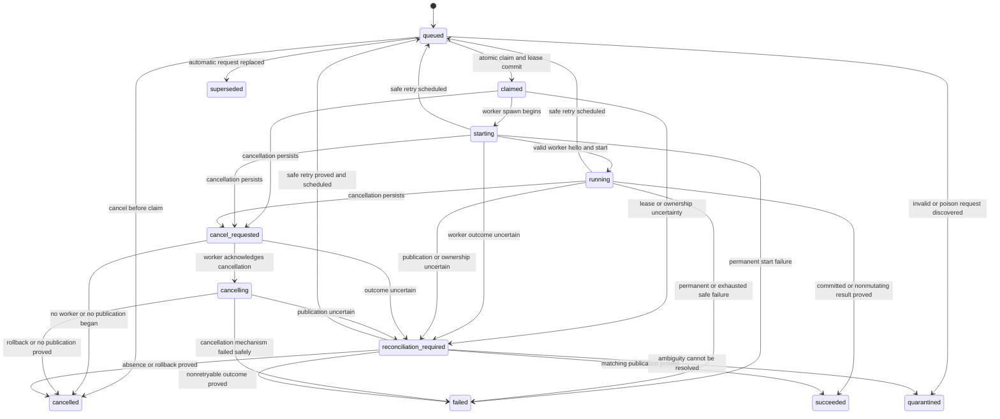

# ASYNC1 Durable Job And Coordinator Contract

Date: 2026-07-13

Status: Accepted design for ASYNC2

## Purpose

This document defines the versioned durable-job and coordinator contracts
selected by ADR 0039. It is the implementation boundary for ASYNC2 and later
ASYNC phases. It fixes job identity, legal state transitions, claims, leases,
graph mutation ownership, idempotency, coalescing, source and configuration
generations, the worker protocol, publication uncertainty, cancellation,
progress, retries, retention, local client transport, authorization, process
ownership, recovery, backpressure, watcher inputs, and synthetic acceptance
criteria.

ASYNC1 is documentation-only. It does not add a control database, migration,
coordinator, worker, watcher, client transport, dependency, or production
behavior.

## Relationship To ADR 0039

ADR 0039 at
`docs/adr/2026/07/0039-synchronous-and-asynchronous-architecture.md` is the
governing architecture decision. This design refines its selected hybrid model:

```text
persistent Python asynchronous coordinator
→ durable PostgreSQL job records
→ bounded synchronous worker subprocesses
→ one existing semantic implementation
```

The design does not change these ADR 0039 decisions:

- synchronous forced-full execution remains the first-release architecture;
- asynchronous coordination is not a storage-throughput claim;
- one semantic worker implementation serves direct and coordinator-backed
  execution;
- one mutating owner is permitted per graph;
- source generations and publication checks prevent stale graph publication;
- durable rows and polling are authoritative while notifications are hints;
- MCP remains read-only;
- lifecycle and destructive operations remain CLI-owned; and
- high-scale and transactional incremental storage remain separate deferred
  decisions.

ADR 0040 is not required. Material changes to the selected topology, authority
boundary, queue semantics, or publication model require an ADR review rather
than an unrecorded implementation deviation.

## Evidence And Constraints

The contract is grounded in current repository behavior and prior phase
evidence:

- current graph refresh is synchronous and uses configured graph identity,
  root validation, static discovery, canonicalization, bounded PostgreSQL
  streaming, and one authoritative transaction;
- refresh of enabled graphs is presently sequential;
- GO21 demonstrated that a failed full refresh must not partially publish;
- GO22 established bounded client-side streaming without changing the one-
  transaction publication contract;
- GO23 retained forced-full refresh and separated coordination from set-based,
  `COPY`, staging, and incremental-storage work;
- current `psql` subprocess handling isolates child output and bounds launch,
  nonzero, malformed, empty, interruption, and stream failures;
- the Go helper protocol supplies an existing versioned JSONL precedent with a
  one-mebibyte line limit and a 64-KiB diagnostic limit;
- current MCP operations are read-only, paginated, deterministic, and redacted;
- current lifecycle operations use exact configured targets and backup-first
  destruction; and
- LOCAL41 upheld dedicated per-graph databases, protected source inputs,
  explicit rebuild composition, CLI lifecycle authority, path-free metadata,
  and canonical product readback.

Current implementation overrides stale intermediate prose. This design does
not claim that queue or coordinator behavior already exists.

## External Research Applied

The design used primary documentation current on 2026-07-13:

- PostgreSQL `SELECT` documents `FOR UPDATE SKIP LOCKED` as appropriate for
  queue-like multi-consumer tables while warning that it is not a general
  consistent-view mechanism;
- PostgreSQL explicit-locking documentation distinguishes session and
  transaction advisory-lock lifetimes;
- PostgreSQL `LISTEN` and `NOTIFY` documentation establishes commit-time
  registration and delivery, startup races, bounded payloads, and durable-table
  requirements;
- PostgreSQL transaction documentation establishes command-level snapshots in
  Read Committed and mandatory retries for serialization failures;
- the PostgreSQL protocol documentation establishes that cancellation or a
  broken connection can leave transaction resolution unknown;
- Psycopg documents explicit transaction ownership, bounded synchronous and
  asynchronous pools, shared-connection serialization, and asynchronous-event-
  loop constraints on Windows;
- Python documents structured task ownership, subprocess stream limits,
  cancellation cleanup, POSIX local sockets, Windows event-loop constraints,
  and authenticated local connection primitives;
- operating-system service documentation establishes supervisor-owned process
  lifecycle rather than self-daemonization; and
- watcher documentation consistently treats native events as fallible across
  editors, network filesystems, overflow, and platform backends.

References appear at the end of this document. No dependency is selected by
this research.

## Design Principles

1. Durable database state, not process memory, is authoritative.
2. Queue delivery is at least once; execution and publication are made safe by
   idempotency, fencing, generation validation, and reconciliation.
3. A graph has at most one mutating owner.
4. A claim permits worker startup only after the claim and graph lease commit.
5. A worker exit code never proves publication state.
6. Unknown publication state is reconciled before retry.
7. Filesystem events and database notifications are wake hints only.
8. Manual operator intent is never silently erased by automatic coalescing.
9. Client input cannot select roots, databases, executables, SQL, credentials,
   or destructive operations.
10. Every queue, stream, process, retry, diagnostic, and retained record class
    is bounded.
11. Public status remains path-free, payload-free, deterministic, and bounded.
12. The coordinator does not acquire graph lifecycle authority.

## Responsibility Boundary

### Coordinator Ownership

The coordinator owns durable intent, deterministic job ordering, claims,
leases, graph-level scheduling, bounded cross-graph concurrency, worker
lifecycle, persisted cancellation requests, progress aggregation, retries and
backoff, startup reconciliation, watcher and polling hint intake, the local
client protocol, and all control-database interactions.

### Worker Ownership

One worker owns one approved semantic operation, static source access within
the resolved configured graph scope, the existing extraction,
canonicalization, and storage semantics, operation-local transaction ownership,
bounded progress emission, cooperative cancellation points, and one final
versioned result.

The coordinator does not implement graph semantics. The worker does not claim
jobs, renew leases, schedule other work, accept clients, resolve arbitrary
configuration, or perform lifecycle operations.

### Existing Product Contracts

The design preserves one authoritative latest graph, no partial publication,
deterministic canonical output, exact evidence ownership, protected read-only
source roots, no target-code execution, dedicated graph databases, CLI-owned
destructive lifecycle, read-only MCP, path-free public output, forced-full
first-release refresh, and separate high-scale and incremental-storage epics.

## Initial Job Taxonomy

| Job kind | Classification | Initial disposition |
| --- | --- | --- |
| `refresh_graph` | Graph-mutating | Sole ASYNC2 durable pilot kind, using synthetic behavior only. |
| `refresh_all_enabled` | Graph-mutating parent orchestration | Future candidate; expands into separately leased graph jobs. |
| `preflight_graph` | Read-only | Direct initially; future durable candidate only with evidence. |
| `reconcile_graph` | Read-only intent analysis that may submit graph-mutating work | Future coordinator-internal candidate. |
| `read_summary` | Read-only | Direct initially; future durable candidate only with evidence. |
| `read_status` | Read-only | Direct initially; future durable candidate only with evidence. |
| database init, migration, backup, restore, drop, reset, or prune | Lifecycle | Prohibited in the job protocol. |
| arbitrary SQL, executable, connector, root, database, or command | Prohibited | Not representable. |

### `refresh_graph`

`refresh_graph` is the sole initial mutating job kind. It accepts one configured
graph ID and invokes the existing forced-full semantic refresh through the
worker boundary. It may be submitted manually or generated by reconciliation.

ASYNC2 uses only a synthetic implementation of this kind. A real configured
graph refresh is not authorized until a later phase supplies the required
publication marker and adapter without weakening the current transaction.

### `refresh_all_enabled`

`refresh_all_enabled` is a future orchestration request, not one global mutating
worker. Its accepted implementation must snapshot the enabled configured graph
IDs and create one independently leased `refresh_graph` child for each graph.
The parent summarizes child state and never owns all graph leases at once.

It is excluded from the ASYNC2 pilot.

### ASYNC16 Desired-State Reconciliation

ASYNC16 implements the polling-first desired-state boundary described by this
contract. A coordinator-owned scheduler reads only enabled configured graphs
whose refresh policy is `polling` or `continuous`; both policies use bounded
polling in this phase. `manual` remains operator-only, while `startup_check`
and `watch` remain explicitly deferred.

Each poll computes a bounded source inventory without executing target code.
The inventory is deterministic, exclusion-aware, repository-relative, and
content-aware: sorted regular-file records contain relative path, entry type,
and content digest and are hashed with the versioned `sg1` source-generation
algorithm. File count and total bytes are bounded evidence only; source text,
path lists, and digests are never written to control rows or public results.
Per-file metadata before/after checks, directory metadata checks, bounded
retries, cancellation, timeout, symlink/reparse rejection, and file/byte/path
limits prevent an unstable or incomplete scan from becoming authoritative.

The reconciler compares source, configuration, extractor, and canonicalizer
generations with the latest complete graph publication receipt. A mismatch
uses the existing automatic `refresh_graph` coalescing path; an equal receipt
records current state without graph mutation. Duplicate polls, queued
generation replacement, and one running follow-up retain the existing durable
coalescing rules. An unavailable, invalid, unstable, cancelled, or
publication-unknown result records only a bounded condition and retry
eligibility, preserving the last accepted graph and never fabricating a
generation. Manual publication remains independent and can satisfy matching
automatic desired state.

The scheduler reconstructs eligible schedules in memory on coordinator start,
uses monotonic waits with deterministic bounded jitter, and admits work through
a small coordinator-owned polling pool. There is at most one active poll per
graph, a fixed global poll capacity, a bounded startup batch, and a derived
aggregate hash/open-file bound from the source scanner's per-poll maxima. Due
graphs are ordered by eligibility time, failure/backoff class, last completion,
and stable graph ID; configuration-file and filesystem enumeration order are not
priority inputs. Restart and missed intervals mark graphs due once and admit
bounded batches rather than multiplying jobs. Its health projection contains
only capped scalar counts and categories. An unexpected scheduler exception is
contained at the task boundary and reports a bounded degraded scheduler
category without silently terminating claim, heartbeat, transport, worker,
publication-fence, or shutdown tasks. A stopped scheduler is not restarted with
a cancelled reconciler; coordinator restart reconstructs a new instance. The
existing claim, heartbeat, graph-lease, worker, publication-fence, and shutdown
tasks remain independently owned.

No schema migration or dependency is introduced. `coalescing_state.next_reconcile_at`
is updated when a row already exists; schedule reconstruction does not create
rows for unavailable sources. A future watcher adapter may provide only a
graph-scoped category/timestamp/overflow hint through `start`, `next_hint`,
`health`, `rescan_required`, and `stop`; ASYNC16 does not implement or persist
watcher events, and polling remains authoritative.

### ASYNC17 Watcher Dependency Evaluation

ASYNC17 evaluates native platform notifications, `watchdog`, `watchfiles`, and
direct native wrappers as optional polling accelerators. Native queues and
buffers can overflow, events can be coalesced or reordered, and network or
unsupported filesystems can omit notifications. Therefore no candidate may
establish freshness or publication authority. Any future adapter must emit
only graph ID, a bounded category, an observation timestamp, and an overflow
or rescan marker. The coordinator converts every hint into a complete polling
reconciliation; raw paths, contents, digests, and event records remain
prohibited.

ASYNC17 selects no watcher dependency or native implementation. `watchdog` has
useful cross-platform backends but adds a threaded event-queue dependency and
documented backend caveats. `watchfiles` provides an asyncio API but adds a
Rust/compiled Notify dependency and wheel/source-build obligations. Direct
`ctypes` wrappers would duplicate native cancellation and overflow code across
platforms. Polling remains the supported baseline until a later phase supplies
disposable native canaries and an explicit dependency decision.

### ASYNC18 Multi-Graph Polling And Coordinator Operational Hardening

ASYNC18 hardens the polling implementation for bounded multi-graph local use
without changing the desired-state or publication contracts. A coordinator-owned
standard-library worker pool admits a fixed number of polls, prevents overlap
for one graph, limits launches per scheduler cycle, and drains startup or
wake backlog in deterministic batches. The ordering key is eligible time,
failure/backoff class, last completed poll, then stable graph ID. New, disabled,
manual, or removed configuration entries are reconciled on reload: eligible
entries become due, ineligible entries stop future scheduling, and product graph
state and manual work are preserved.

Graph-local unavailable, invalid, unstable, timeout, publication, cancellation,
and polling failures use capped exponential backoff with deterministic jitter.
They do not degrade the scheduler or create one job per retry. Successful
current, requested, or coalesced outcomes reset the graph failure count. The
scheduler reports bounded scalar health for capacity, startup backlog, due work,
outcome categories, backoff, oldest due age, and shutdown status; no roots,
filenames, digests, database identities, credentials, or raw exceptions enter
public health. Health counters are capped to a signed 32-bit maximum.

The existing durable automatic coalescing rows, queued/running replacement
links, manual priority, graph leases, fencing epochs, and complete publication
receipts remain the authorities. Polling does not bypass the queue, mutate graph
storage, infer freshness from process or job state, or delete product state when
a graph disappears from configuration. Existing current-state retention and
reconciliation evidence remain sufficient; ASYNC18 adds no table, migration, or
per-poll history. No watcher dependency, native watcher code, raw event
persistence, WSL-specific implementation, Windows startup packaging, or MCP
mutation is introduced.

### ASYNC19 Coordinator Operator Adoption And Default-Mode Evaluation

ASYNC19 recommends the coordinator for routine local operation while retaining
explicit mode selection and the existing direct refresh default. An explicit
coordinator request requires an already-running compatible service; connection
failure is reported and never installs, starts, or falls back to direct mode.
The neutral operator lifecycle remains CLI-owned, and service-package adapters
remain optional wrappers around the foreground entrypoint.

Coordinator health is a version-1 path-free projection with these bounded
sections: `service`, `ownership`, `queue`, `workers`, `publication`, `polling`,
`transport`, and `storage`. Lifecycle, ownership, transport, and polling facts
are reported only from current authoritative state. Sections without a bounded
provider use `not_reported`; health does not infer queue pressure, worker
completion, publication freshness, or storage readiness from process exit,
queue emptiness, or a terminal job state. Existing top-level `status` and
polling fields remain compatible.

`repomap-kg ops coordinator-health` is a read-only authenticated inspection
surface. It validates the health schema, section vocabulary, response bounds,
and public privacy policy before printing JSON or a bounded table. Existing
control-state, recent-job, cancellation, refresh, and service-package commands
remain separate explicit operations. MCP remains read-only and does not proxy
this lifecycle authority.

ASYNC19 records macOS launchd and Linux systemd packages as optional, documents
WSL as a Linux-style foreground deployment pattern, and retains Windows
foreground-only coordinator support. No native Windows background adapter,
watcher implementation, schema migration, dependency, private graph access,
or automatic lifecycle action is introduced.

### ASYNC20 End-To-End Dogfood And Failure-Recovery Campaign

ASYNC20 exercises the accepted local architecture repeatedly with synthetic
public-safe repositories and disposable PostgreSQL fixtures. The campaign
covers normal startup and refresh, automatic coalescing, manual intent,
polling fairness and backoff, worker and descendant failure, malformed
protocols, publication uncertainty, storage/schema failure, source
unavailability and instability, endpoint/token rotation, configuration reload,
restart/wake simulation, and joined shutdown. Durable intent, graph leases,
singleton fencing, and complete publication receipts remain authoritative in
every scenario.

The bounded campaign result is 536 passed tests, 4 skipped platform or
service-package tests, and no failures across eleven grouped runs. Disposable
cleanup assertions observed no orphan processes or descendants, leaked
endpoint descriptors, unreleased owned leases, temporary service artifacts,
or unbounded automatic queue growth. The result is fixture evidence, not an
enterprise reliability or high-scale claim. Native Windows, WSL, launchd, and
systemd canaries were not available in the campaign environment; prior native
Windows foreground evidence and optional neutral service adapters remain the
accepted platform boundary.

ASYNC20 changes no source, schema, dependency, watcher, MCP, default-mode,
Windows background, or lifecycle authority contract. The explicit decision is
that the ASYNC architecture is ready for ASYNC-CLOSE. Closure must not add
deferred features and must re-run the full repository gate.

### ASYNC-CLOSE Durable Coordinator Architecture Acceptance

ASYNC-CLOSE accepts the bounded local architecture as the durable coordinator
contract. One semantic coordinator and worker implementation owns one durable
job state machine, one mutating graph lease, singleton fencing, complete
publication-generation receipts, explicit direct/coordinator mode, polling-first
desired-state reconciliation, and joined lifecycle. MCP remains read-only and
all lifecycle or service-package mutation remains explicit CLI authority.

The coordinator remains foreground-capable on every supported Python platform.
macOS LaunchAgents and Linux systemd user units are optional adapters around the
same exact foreground entrypoint. Windows foreground transport, descriptor
privacy, environment scrubbing, exact executable resolution, and Job Object
containment remain accepted; Windows native background packaging remains
deferred. No watcher dependency, native watcher, raw event persistence, or
event-driven graph mutation is accepted.

The ASYNC20 campaign and final repository gate provide bounded fixture evidence,
not enterprise or high-scale guarantees. Closure does not add a migration,
dependency, storage backend, remote worker, multi-coordinator authority,
automatic graph deletion, silent fallback, MCP mutation, or default-mode
change. Optional watcher acceleration, Windows native background packaging,
SQLite/Desktop, cloud/enterprise, incremental updates, remote workers,
multi-coordinator scaling, and high-scale ingestion require future phases with
new evidence and decisions.

### `preflight_graph`

`preflight_graph` is read-only. It may later become a durable job when measured
duration or remote waiting justifies that cost. It remains a direct synchronous
operation initially and is excluded from the ASYNC2 durable pilot.

### `reconcile_graph`

`reconcile_graph` is a future coordinator-internal intent kind. It compares the
desired source and configuration generations with the last accepted
publication and creates or updates one automatic `refresh_graph` request when
necessary. It does not mutate a graph directly.

### `read_summary` And `read_status`

These are read-only direct operations. They use committed product state and do
not enter the initial queue. Durable read jobs require separate evidence that
direct bounded reads are inadequate.

### Prohibited Job Kinds

The job schema cannot represent database init, backup, restore, drop, reset,
migration, arbitrary SQL, arbitrary executable invocation, arbitrary root
selection, or arbitrary database selection. Unknown job kinds are rejected.
Lifecycle actions remain explicit CLI operations under existing authorization
and backup-first contracts.

## Versioned Request Envelope

Every accepted job stores an immutable version-1 request envelope. Values are
normalized before the job row commits.

| Field | Ownership | Contract |
| --- | --- | --- |
| `schema_version` | Client proposes; coordinator validates | Exact supported integer; version 1 initially. |
| `job_id` | Coordinator | Opaque durable identifier generated once. |
| `job_kind` | Client | Exact allowlisted kind. |
| `graph_id` | Client | Existing configured graph ID, not a path or database. |
| `request_id` | Client | Bounded caller correlation identifier; not an authorization token. |
| `idempotency_key` | Client | Bounded opaque key scoped to requester, kind, and graph; stored as a one-way digest when practical. |
| `coalescing_key` | Coordinator | Canonical kind-family and graph tuple; never trusted from a client. |
| `priority` | Coordinator | Normalized class and bounded value; a client may request only an allowlisted class and cannot exceed policy. |
| `submitted_at` | Coordinator database | Transaction timestamp in UTC. |
| `requested_by` | Coordinator | Authenticated local-principal category and client identity; not caller-supplied display text. |
| `source_generation` | Coordinator and worker | Versioned opaque generation captured at accepted boundaries. |
| `config_generation` | Coordinator | Versioned digest of execution-relevant resolved configuration. |
| `extractor_generation` | Coordinator | Versioned extractor-profile and implementation marker. |
| `canonicalizer_generation` | Coordinator | Versioned canonical model and implementation marker. |
| `operation_options` | Client, then normalized | Strict per-kind allowlist; unknown keys are rejected. |
| `privacy_class` | Coordinator | Internal policy derived from configured graph privacy. |

The client may supply only `schema_version`, `job_kind`, `graph_id`,
`request_id`, `idempotency_key`, a requested priority class, and allowlisted
operation options. Generation fields in a client request are expectations, not
authority; the coordinator resolves and stores authoritative values. All other
fields are generated or derived by the coordinator.

Request fields are immutable after acceptance. Desired automatic work is
updated in `coalescing_state`, not by rewriting the accepted request envelope.

### Public And Internal Fields

Public local-client status may expose job ID, request ID, kind, graph ID,
normalized priority class, timestamps, state, attempt count, phase, bounded
counts, public-safe error category, and generation match/mismatch markers.

Idempotency digests, coalescing internals, raw generation digests, privacy
policy details, lease tokens, worker tokens, resolved roots, database routing,
connection data, executable arguments, and internal diagnostics are not public
fields.

### Example Accepted Request

```json
{
  "graph_id": "example-graph",
  "idempotency_key": "manual-refresh-001",
  "job_kind": "refresh_graph",
  "operation_options": {
    "reason": "operator-request"
  },
  "priority": "manual",
  "request_id": "request-001",
  "schema_version": 1
}
```

No request field accepts an absolute root, database name, command, SQL text,
credential, backup identifier, or source payload.

## Durable State Machine

The durable states are:

```text
queued
claimed
starting
running
cancel_requested
cancelling
succeeded
failed
cancelled
superseded
quarantined
reconciliation_required
```

`succeeded`, `failed`, `cancelled`, `superseded`, and `quarantined` are terminal.
`reconciliation_required` is a durable recovery state, not a terminal result.
It blocks execution until authoritative reconciliation proves a safe outcome.



### Legal Transitions

| From | To | Authority and condition |
| --- | --- | --- |
| submission | `queued` | Coordinator commits normalized request and idempotency record. |
| `queued` | `claimed` | Claim transaction also acquires the graph lease for a mutating kind. |
| `queued` | `cancelled` | Authorized cancellation before claim. |
| `queued` | `superseded` | Automatic request only; replacement is recorded. |
| `queued` | `quarantined` | Unsupported persisted version, privacy breach risk, or poison condition. |
| `claimed` | `starting` | Coordinator starts the fenced worker after commit. |
| `claimed` | `cancel_requested` | Authorized cancellation wins before startup. |
| `claimed` | `reconciliation_required` | Claim or lease expiry leaves execution ownership uncertain. |
| `starting` | `running` | Worker handshake and `job_start` validation complete. |
| `starting` | `failed` | Permanent, publication-safe startup failure. |
| `starting` | `queued` | Retryable, publication-safe startup failure with backoff. |
| `starting` | `cancel_requested` | Cancellation arrives during handshake. |
| `starting` | `reconciliation_required` | Worker may have crossed an unknown boundary. |
| `running` | `succeeded` | Final result and publication state are proved. |
| `running` | `failed` | Permanent or exhausted failure with known publication state. |
| `running` | `queued` | Retryable failure with `not_started` or `rolled_back` publication. |
| `running` | `cancel_requested` | Authorized cancellation persists. |
| `running` | `reconciliation_required` | Commit, connection, lease, or worker outcome is unknown. |
| `cancel_requested` | `cancelling` | Worker acknowledges and begins bounded cleanup. |
| `cancel_requested` | `cancelled` | Work never began or absence/rollback is already proved. |
| `cancel_requested` | `reconciliation_required` | Cancellation outcome is not authoritative. |
| `cancelling` | `cancelled` | No publication or rollback is proved. |
| `cancelling` | `failed` | Cancellation fails but publication is known safe. |
| `cancelling` | `reconciliation_required` | Publication may have committed. |
| `reconciliation_required` | `succeeded` | Matching committed run is found. |
| `reconciliation_required` | `failed` | A permanent known outcome is proved. |
| `reconciliation_required` | `cancelled` | Absence or rollback is proved after the backend is gone. |
| `reconciliation_required` | `queued` | Retry is proved safe and backoff is scheduled. |
| `reconciliation_required` | `quarantined` | Repeated or irreducible ambiguity requires operator review. |

### State Semantics

| State | Entry and legal predecessors | Legal successors and transition authority | Required time and fields | Retry, lease, cancellation, and client visibility |
| --- | --- | --- | --- | --- |
| `queued` | Accepted submission, or a proved-safe retry from `starting`, `running`, or `reconciliation_required`. | Coordinator may claim, cancel an authorized request, supersede automatic work, or quarantine poison input. | `submitted_at`, `next_eligible_at`, immutable envelope, current attempt, retry count, priority. | Retry waits here without a lease. Queued cancellation is immediate. Public status shows eligibility, priority class, and bounded retry summary. |
| `claimed` | Only from `queued` after the claim, attempt, and required graph lease commit. | Owning fenced coordinator may start, persist cancellation, or require reconciliation. | `claimed_at`, attempt, coordinator instance and epoch, lease owner/expiry for mutation. | Attempt is active; graph lease is held for mutation. Cancellation persists before startup. Owner and lease tokens are internal. |
| `starting` | Only from `claimed` when worker creation begins. | Owning coordinator may mark running, persist cancellation, fail permanently, schedule a proved-safe retry, or require reconciliation. | `starting_at`, attempt, worker launch identity, hello deadline, publication `not_started`. | Lease remains held. Retry is legal only before publication. Client sees `starting`, not process details. |
| `running` | Only from `starting` after valid hello and start exchange. | Worker result plus owning coordinator may produce success, permanent/exhausted failure, proved-safe retry, cancellation request, or reconciliation. | `started_at`, worker identity, heartbeat, phase, bounded progress, generation markers, publication state. | Lease is renewed for mutation. Cancellation is cooperative and persisted. Client sees bounded phase/counts. |
| `cancel_requested` | From `claimed`, `starting`, or `running` after authorized durable cancellation. | Owning coordinator may begin cancelling, prove immediate cancellation, or require reconciliation. | `cancel_requested_at`, requester category, current attempt, last publication state. | No retry. Existing lease remains until safe resolution. Client sees cancellation pending. |
| `cancelling` | From `cancel_requested` after worker acknowledgment or coordinator escalation begins. | Owning coordinator may prove cancellation, record safe cancellation failure, or require reconciliation. | `cancelling_at`, acknowledgment category, grace deadline, attempt, publication state. | Lease remains held. Force termination is bounded. Client sees cancelling and bounded phase. |
| `succeeded` | From `running` or `reconciliation_required` after committed publication, or proved nonmutating success. | None. | `finished_at`, final result, `committed` or `not_applicable`, reconciled run identity where mutating. | Terminal and never retried. Lease is released only after terminal commit. Cancellation may be recorded as not applied. Public result is bounded. |
| `failed` | From `starting`, `running`, `cancelling`, or `reconciliation_required` after permanent or exhausted failure with known publication state. | None. | `finished_at`, error category, attempt summary, retry exhaustion/permanence, safe publication state. | Terminal. No lease remains. Cancellation is not accepted. Public error is categorized and sanitized. |
| `cancelled` | From `queued`, `cancel_requested`, `cancelling`, or `reconciliation_required` after no publication or rollback is proved. | None. | `finished_at`, `cancel_requested_at` when applicable, cancellation category, safe publication state. | Terminal and never retried. No lease remains. Public status states whether a worker started. |
| `superseded` | Only queued automatic work may enter after a recorded replacement or satisfying publication is known. | None. | `finished_at`, replacement job or satisfying run reference, supersession reason category. | Terminal and never retried. It owns no lease. Manual work cannot enter silently. Public status identifies the replacement. |
| `quarantined` | From `queued` or `reconciliation_required` for poison input, incompatible persisted version, privacy risk, or irreducible contradictory evidence. | None; resume creates a new reviewed job rather than mutating the terminal record. | `finished_at`, quarantine category, bounded review marker, last attempt/publication evidence. | Terminal. No lease remains after safe isolation. Public status omits sensitive diagnostic content. |
| `reconciliation_required` | From `claimed`, `starting`, `running`, `cancel_requested`, or `cancelling` when ownership or publication is uncertain. | Reconciler may prove success, failure, cancellation, safe retry, or quarantine. | `reconciliation_started_at`, attempt, prior owner/epoch, last publication state, reason, next inspection time. | No retry and no new mutating lease holder until old execution is proved incapable of publication. Cancellation remains pending. Public status shows reconciliation, not guessed outcome. |

No terminal state has an outgoing transition. An attempt failure may return a
job to `queued`; attempt history records the failure while the job itself does
not enter terminal `failed` until retry policy is exhausted or the error is
permanent.

State updates use compare-and-set predicates that include the expected state,
attempt, coordinator fencing epoch, and lease owner when applicable. A stale
coordinator or worker cannot advance a newer attempt.

## Claiming, Leasing, And Graph Mutation Ownership

### Claim Transaction

An eligible claim uses one short Read Committed transaction:

1. select an eligible `queued` job ordered by normalized priority, eligibility
   time, submission time, and job ID;
2. lock the candidate with `FOR UPDATE SKIP LOCKED`;
3. validate that its persisted schema and configuration are usable;
4. acquire or conditionally replace the expired graph lease for a mutating
   kind;
5. create the next attempt with the coordinator fencing epoch;
6. change the job to `claimed`; and
7. commit before any worker process starts.

`SKIP LOCKED` is used only for queue claiming. It is not used to construct a
general consistent view.

Eligibility requires `next_eligible_at` at or before database time and attempts
below the configured maximum. Within one priority class, ordering is first-in,
first-out by submission time and job ID. Manual priority is bounded and cannot
bypass same-graph ownership. A configurable bounded manual-claim burst is
followed by the oldest eligible automatic job when one exists, preventing an
unbounded manual stream from starving reconciliation. The burst, global worker
limit, per-class capacity, lease duration, renewal interval, and maximum
attempts have safe defaults and hard maxima fixed by ASYNC2 evidence.

### Graph Lease

A durable graph lease is keyed by graph ID and contains job ID, attempt number,
coordinator instance, coordinator fencing epoch, worker identity when known,
heartbeat time, and expiry time. The graph ID key enforces at most one mutating
lease per graph.

Renewal is conditional on the same job, attempt, owner, and fencing epoch.
Failure to renew stops new worker actions and moves the job to
`reconciliation_required`; it does not authorize another worker to publish
immediately.

Lease release is a conditional control-database update after terminal or
reconciled state commits. A coordinator never releases a lease merely because
a timeout elapsed. An abandoned claim, graph-database restart, connection loss,
or worker crash moves through reconciliation. A graph-database restart is
expected to roll back an open transaction, but rollback or matching publication
must still be observed before retry. Poisoned jobs quarantine after the bounded
threshold and cannot retain a live lease.

An in-process mutex may reduce local contention but is never authoritative.
PostgreSQL advisory locks are not the primary lease because session lifetime,
rollback behavior, connection pooling, and crash diagnostics do not provide the
required durable ownership record.

### Mutating And Read-Only Overlap

Only mutating jobs acquire graph leases. Read-only operations observe committed
product state and never inspect a worker's uncommitted transaction. Initial
read-only operations remain direct. If read-only jobs are queued later, they
use a separately bounded read pool and cannot delay lease renewal or
publication reconciliation.

### Expiry And Crash Recovery

Lease expiry does not mean the worker definitely stopped. On coordinator crash,
worker loss, or expiry:

- the job enters `reconciliation_required`;
- the graph remains unavailable for a new mutating worker until the old worker
  is proved gone and publication is reconciled;
- a matching committed publication completes the job as `succeeded`;
- proved absence or rollback permits cancellation or a bounded retry; and
- conflicting evidence quarantines the job and graph intent.

PID reuse or process absence alone cannot prove transaction outcome.

## Coordinator Singleton And Fencing

The initial deployment permits one active coordinator per control database.
`coordinator_instances` contains a singleton scope lease and monotonically
increasing fencing epoch.

Startup fails closed when a live coordinator lease exists. Stale takeover
requires expiry, a new fencing epoch, inspection of all nonterminal jobs and
leases, and reconciliation of surviving workers. A process identifier is
diagnostic only. Every mutating compare-and-set includes the fencing epoch, so
an old coordinator cannot resume ownership after a pause.

Multiple active coordinators are a review-triggered future capability. Queue
claiming is nevertheless designed with row locks so ASYNC2 can prove synthetic
claim races without adopting multi-coordinator deployment.

## Source And Configuration Generations

### Source Generation

A source generation is an opaque, versioned digest such as `sg1:<digest>` over
the configured repository scope and a deterministic, exclusion-aware source
inventory. The inventory uses repository-relative paths, entry type, and
content identity. It does not derive product identity from an absolute checkout
path, process ID, timestamp, or filesystem enumeration order.

Git metadata may contribute a revision marker, but dirty files, untracked
included files, renames, and non-Git roots require content-aware inventory.
Metadata-only timestamps are insufficient. The control contract stores the
opaque digest without path lists or source text; ASYNC16 keeps algorithm
identity and bounded count evidence in the polling implementation and health
projection without adding a control-schema migration.

Generation checkpoints are:

1. submission or reconciliation hint, for coalescing only;
2. claim, as the intended generation;
3. worker start, as the extracted input generation; and
4. immediately before publication, as the publication generation check.

A running refresh may publish only when the worker-start and pre-publication
source generations match and the intended generation has not been superseded
by an incompatible manual or configuration decision. A mismatch prevents
commit, records a stale result, and schedules at most one follow-up request.

The later real-refresh adapter must place the final check inside the existing
authoritative transaction before `COMMIT`. ASYNC2 proves the rule synthetically.

### Configuration Generation

A configuration generation is an opaque, versioned digest such as
`cg1:<digest>` over execution-relevant resolved configuration:

- graph ID and configured repository scope;
- an internal root-location token;
- normalized exclusions and extractor profile;
- privacy, enabled, and refresh-policy values;
- internal storage-routing identity;
- extractor and canonicalizer generations; and
- worker-protocol and publication-contract versions.

Credentials, unrelated graphs, raw paths in public output, and volatile process
state are excluded. The internal root and storage routing influence the digest
without becoming public metadata.

An automatic queued request with stale configuration may be superseded by one
recorded replacement. A manual request is never silently coalesced away. If its
configuration no longer matches, it reaches a public-safe configuration
failure with a replacement reference or proceeds only after an explicit new
submission. A running job with a configuration mismatch cannot publish.

### Extractor And Canonicalizer Generations

These markers identify the profile and semantic implementation that produced a
candidate graph. They are independent fields because an extractor change and a
canonical model change have different review and reconciliation implications.
Changes create automatic desired-state work; they do not mutate accepted
manual envelopes.

## Idempotency Contract

Request idempotency is enforced by a unique key over authenticated requester
scope, job kind, graph ID, and the digest of `idempotency_key`.

- the first accepted request commits the durable job;
- an identical normalized request returns the existing job and terminal result
  when present;
- reuse of the same key with a different normalized request is a conflict;
- the key remains retained at least as long as its terminal job result;
- missing idempotency keys are rejected for mutating submissions; and
- idempotency does not imply exactly-once execution.

The replay response returns the original job ID, current or terminal state, and
a public-safe `replayed` marker. It never returns the stored key digest. Terminal
result reuse follows the job's retention class; cleanup removes the job and its
idempotency identity atomically only after the retention window. Exact retention
durations are configuration selected and tested in ASYNC2.

Execution idempotency uses job ID, attempt number, fencing epoch, graph lease,
generation checks, and transaction rollback. Publication idempotency requires
an accepted run marker that can be queried by job ID, attempt, graph, and
generation. ASYNC6 provides that marker for the internal forced-full adapter:
the authoritative run row stores one all-or-none job, attempt, and
four-generation receipt, and a bounded read locates a completed run by exact
attempt. ASYNC7 composes this receipt with an internal configured-graph resolver and
the existing machine-local service while direct mode remains the public default.
ASYNC8 scans a stable bounded set of reconciliation-required attempts under the new
singleton fence, resolves exact configured receipts before accepting clients, and
keeps changed or unavailable routes paused. ASYNC9 exposes the service through an
explicit foreground launch and non-default coordinator refresh mode. The client supplies
one graph ID and durable idempotency identity; endpoint, executable, storage, source, and
configuration authority remain service-owned.

The control store retains its idempotent publication-evidence ledger. ASYNC2
used synthetic markers; ASYNC6 feeds the same classifier from authoritative
graph readback for the disposable internal adapter.

## Coalescing Contract

Automatic desired-state work is coalesced by graph and job-kind family.

- duplicate watcher or notification hints update one desired-generation record;
- at most one queued automatic refresh is retained for a graph;
- reasons are a bounded set of sanitized categories, not raw paths or event
  payloads;
- priority is normalized to the highest permitted automatic class;
- a newer automatic queued job may supersede an older automatic queued job,
  with both records linked;
- a manual job is separate and cannot be silently superseded by automatic work;
- an event during a running job marks the graph dirty and creates or updates one
  follow-up after the attempt resolves; and
- coalescing never cancels a transaction in its publication-critical section.

Many file changes, mass rename, source deletion, branch switch, watcher
overflow, event storm, and periodic reconciliation all collapse into a bounded
automatic desired-generation intent. A configuration change, extractor
upgrade, or canonicalizer upgrade changes the corresponding generation and
therefore replaces older queued automatic intent explicitly. Repository
unavailability records a bounded source-unavailable condition and a future poll
rather than manufacturing a generation. Generation comparison uses exact
versioned-token equality; the coordinator does not order opaque digests.

If a manual and automatic request target the same generation, they may execute
under one graph lease sequentially. The automatic request may complete as
`superseded` only when the recorded manual publication satisfies the same
desired generation. The manual record remains independently visible.

## Worker Process Protocol

### Transport And Framing

The coordinator starts workers with an exact executable and argument vector;
it never uses a shell. Standard input and standard output carry UTF-8 newline-
delimited JSON, one object per line. Standard error is a separate bounded
diagnostic channel and is never parsed as protocol.

Version 1 adopts existing repository bounds:

- maximum protocol line: one mebibyte; and
- maximum retained worker diagnostic: 64 KiB after sanitization.

The coordinator rejects oversized, malformed, non-object, duplicate-terminal,
out-of-order, unsupported-version, and unknown-message input. Version 1 uses
exact allowed fields. Future compatible extensions require a new negotiated
protocol version rather than silently accepting arbitrary fields.

Every wire object contains `schema_version` and `message_type`. Messages after
hello also contain job ID and attempt. Message-specific schemas require only
the fields named by that message, forbid unknown fields in version 1, and use a
coordinator-validated sequence when ordering could otherwise be ambiguous.
Unknown message types terminate the attempt as a protocol failure. Source data,
raw observations, SQL, roots, database names, credentials, command arrays, and
unbounded tracebacks are forbidden on every protocol channel.

### Message Types And Order

| Message | Direction | Contract |
| --- | --- | --- |
| `worker_hello` | Worker to coordinator | First message; declares exact protocol versions, worker implementation, capabilities, and process nonce. |
| `job_start` | Coordinator to worker | Supplies one normalized, capability-limited job after validating hello. |
| `progress` | Worker to coordinator | Bounded phase and counters; throttled and non-authoritative for publication. |
| `heartbeat` | Worker to coordinator | Proves protocol liveness for the current attempt; lease renewal remains coordinator-owned. |
| `cancel` | Coordinator to worker | Requests cancellation with job and attempt identity. |
| `cancel_ack` | Worker to coordinator | States accepted, deferred, or already-complete cancellation handling. |
| `result` | Worker to coordinator | Exactly one successful or cancelled terminal semantic result. |
| `error` | Worker to coordinator | Exactly one bounded failure result with category and publication state. |
| `worker_exit` | Coordinator-internal event | Synthesized only after OS process wait; never trusted from worker stdout. |

The coordinator requires a bounded hello deadline, job deadline, heartbeat
deadline, cancellation grace period, and process-termination grace period.
ASYNC2 fixes tested configurable defaults and hard maxima from synthetic
evidence; ASYNC1 does not invent unevidenced operational durations.

### Example Worker Exchange

```json
{"capabilities":["refresh_graph"],"message_type":"worker_hello","process_nonce":"nonce-001","protocol_versions":[1],"schema_version":1,"worker_generation":"worker-v1"}
{"attempt":1,"config_generation":"cg1:example","graph_id":"example-graph","job_id":"job-001","job_kind":"refresh_graph","message_type":"job_start","schema_version":1,"source_generation":"sg1:example"}
{"attempt":1,"completed":12,"heartbeat_at":"2026-07-13T12:00:02Z","job_id":"job-001","message_category":"files-discovered","message_type":"progress","phase":"discovery","schema_version":1,"total":null,"unit":"files"}
{"attempt":1,"heartbeat_at":"2026-07-13T12:00:03Z","job_id":"job-001","message_type":"heartbeat","schema_version":1}
{"attempt":1,"canonical_edges":18,"canonical_nodes":15,"canonicalizer_generation":"canonical-v1","config_generation":"cg1:example","diagnostics":[],"error_category":null,"extractor_generation":"extractor-v1","files":12,"finished_at":"2026-07-13T12:00:04Z","graph_id":"example-graph","job_id":"job-001","job_kind":"refresh_graph","latest_run_identity":"run-001","message_type":"result","observations":24,"phase":"complete","publication_state":"committed","retryable":false,"schema_version":1,"source_generation":"sg1:example","started_at":"2026-07-13T12:00:01Z","status":"succeeded","warnings":[]}
```

JSON objects shown here are valid examples, not proof of an implemented wire
protocol. Fields containing paths, source excerpts, connection data, raw
observations, or unbounded diagnostics are prohibited.

### STR-SEAM3 Portable Snapshot Seam Extension Delta Table

| Dimension | Existing ASYNC1 Protocol | STR-SEAM3 Extended Protocol Seam |
| --- | --- | --- |
| Capability Negotiation | `capabilities: ["refresh_graph"]` in `worker_hello` | Adds optional `portable_snapshot_v1` in `worker_hello` |
| Request Payload (`job_start`) | Graph identity, `sg1:`, `cg1:` generations | Optional `portable_snapshot` envelope carrying `contract_version: "1.0"`, `required: true`, and `ArtifactReference` for `snapshot_manifest` (`snapmanifest1:`) |
| Request Security | Forbids SQL, host paths, credentials, tokens | Same; locators are store-relative only; credentials, signed URLs, and host paths fail closed |
| Terminal Result (`result`, `error`) | Requires `publication_state: "committed"` and `latest_run_identity` on success | Optional `portable_snapshot` result extension carrying `contract_version: "1.0"`, typed `outcome`, receipt status/reference, bounded receipt-write diagnostic, and optional bundle reference; current completed output requires both references, while current failed/cancelled output may explicitly report an unavailable receipt; `publication_state: "not_started"`, `latest_run_identity: null` |
| Terminal Distinctions | Success (`succeeded`), Cancellation (`cancelled`), Failure (`failed`) | Typed outcomes: `completed`, `cancelled`, source unavailable/changed/invalid/capture, artifact missing/stale/corrupt/bounds, manifest bounds, unsupported contract/capability, contract validation, malformed protocol, identity mismatch, and semantic workload failure |
| Error Categories | Legacy `_ERROR_CATEGORIES` vocabulary | Adds the exact source, artifact, capability, and contract classes above; a failure extension outcome must equal `error_category` |
| Publication Authority | Worker directly writes and commits to PostgreSQL | Worker emits untrusted receipt and deterministic bundle; publisher owns validation and atomic publication |
| Replay & Idempotency | Attempt reuse checks database run identity | Validator enforces attempt uniqueness, receipt/bundle digest matching, and idempotent replay |

### STR-WORK4 execution capability

The portable worker receives physical store access only through one parent-created,
owner-private capability file. Version 1 binds the exact job, attempt, graph,
generations, immutable manifest reference/store version, filesystem store root,
attempt-workspace root, and artifact/bundle byte bounds. Unknown fields, symlinks,
non-private modes, missing object versions, substitution, and identity disagreement
fail before semantic work. Database, registry, source-root, command, provider, network,
and publication authority are not representable.

The worker advertises the existing extension, runs in a private unrelated `cwd` with a
closed environment, and uses the existing managed-process cleanup owner. Legacy request
and terminal bytes remain unchanged when the extension is absent. Direct and
coordinator production refresh do not select this entrypoint in STR-WORK4.

STR-WORK4-FIX2 completes the runtime audit guard at that entrypoint. Behavioral
managed-process owners prove denial of database/control/lifecycle/publisher imports,
network and DNS operations, subprocess/exec/spawn/system/fork operations, and
unattributed filesystem reads or writes. Trusted lazy reads are limited to interpreter,
standard-library, installed dependency, exact RepoMap package, store, and workspace roots.
This is a capability/allowlist boundary, not OS-grade hostile-code confinement.
Current portable staging-family rows declare `row_stage_contract:
stage-unassigned-v1` and carry the fixed non-authoritative `stage-unassigned`
placeholder on every row. Only headers without that field enter the explicit
`legacy-absent-v1` decoder, which requires every row to omit `stage_id`. Mixed or
physical-stage shapes fail. STR-PUB5 alone will generate and substitute the physical
PostgreSQL stage identifier.

When `portable_snapshot_v1` is negotiated, every emitted success, cancellation, or
typed failure terminal carries the result extension. Current output adds
`receipt_status` and `receipt_diagnostic`; `receipt: null` is valid only for a
non-completed outcome with an explicit closed receipt-write failure. The parent validates the extension
and preserves a primary process/protocol failure if exact-owner cleanup also fails. A
portable terminal always remains `publication_state: not_started`; worker exit or bundle
presence cannot create `commit_unknown`. Deterministic barriers cover manifest,
materialization, semantic, bundle, pre-terminal, and parent-wait cancellation. Cleanup
failure remains bounded secondary evidence and cannot replace cancellation or the
primary typed failure.

## Worker Result Contract

A terminal `result` or `error` contains at least:

| Field | Requirement |
| --- | --- |
| `schema_version` | Required exact result-schema version. |
| `job_id`, `job_kind`, `graph_id`, `attempt` | Required identity matching the accepted attempt. |
| `status` | Required semantic outcome. |
| `started_at`, `finished_at` | Required coordinator-comparable UTC times. |
| `phase` | Required final accepted phase. |
| `files`, `observations`, `canonical_nodes`, `canonical_edges` | Required for `refresh_graph`; absent or `null` for kinds where the count is not applicable. |
| `warnings`, `diagnostics` | Required bounded arrays of known sanitized categories. |
| `publication_state` | Required explicit publication outcome. |
| `latest_run_identity` | Required for committed mutating work; otherwise `null`. |
| `source_generation`, `config_generation` | Required for graph-scoped work. |
| `extractor_generation`, `canonicalizer_generation` | Required for refresh work. |
| `retryable` | Required worker recommendation; coordinator policy remains authoritative. |
| `error_category` | Required and `null` on success; bounded category on error. |

For `refresh_graph`, allowed counts are files, observations, canonical nodes,
canonical edges, and bounded storage-summary counts already accepted by the
existing operation. A result does not include node data, edge data, raw
observations, source excerpts, SQL, root paths, database names, connection
values, child command arrays, or raw stderr.

Unknown result fields and missing required fields are protocol failures. Counts
must be nonnegative bounded integers. Warnings and diagnostics are bounded
arrays of known categories.

## Publication-State Contract

Publication state is independent of job state:

```text
not_applicable
not_started
prepared
transaction_started
committed
rolled_back
commit_unknown
```

- `not_applicable` is valid only for nonmutating work.
- `not_started` proves no storage transaction began.
- `prepared` means candidate work exists but the authoritative transaction did
  not begin.
- `transaction_started` means publication may be in progress.
- `committed` requires an authoritative matching publication marker.
- `rolled_back` requires a confirmed rollback or confirmed vanished uncommitted
  backend.
- `commit_unknown` means neither commit nor rollback can be proved.

The worker reports phase boundaries, but the coordinator accepts `committed`
only after the database acknowledges completion and reconciliation can locate
the matching publication marker. Connection loss, process loss, cancellation,
or timeout at or after commit initiation produces `commit_unknown`, regardless
of exit code.

The worker owns the graph transaction and binds its run identity to job,
attempt, graph, and generations. `transaction_started` is reported only after
the worker acquires transaction ownership. Commit acknowledgement requires the
driver to complete the commit exchange and return to a usable transaction
state. Connection loss before transaction start is `not_started`; loss during
an open transaction is `rolled_back` only after rollback or backend termination
is confirmed; loss after commit request is `commit_unknown`. Rollback
confirmation includes the failed/cancelled attempt and cannot be inferred from
worker exit.

### Reconciliation Outcomes

For `commit_unknown`, the coordinator queries authoritative graph publication
metadata after the old backend is no longer capable of changing state:

- a matching job, attempt, graph, and generation marker means `succeeded`;
- proved absence with rollback or backend termination permits safe retry or
  cancellation;
- a conflicting marker is `quarantined`; and
- insufficient evidence remains `reconciliation_required` and is never
  retried blindly.

If cancellation was requested but the matching commit succeeded, the job is
`succeeded` with a bounded `cancellation_not_applied` marker. The coordinator
does not misreport committed product state as cancelled.

## Cancellation Contract

Cancellation is a durable request, not an assumption that work stopped.

1. An authorized local client records the cancellation.
2. A queued job becomes `cancelled` immediately.
3. A claimed or running job becomes `cancel_requested`.
4. The coordinator sends `cancel` and waits for `cancel_ack` within a bound.
5. The worker cancels discovery or computation cooperatively, or requests
   PostgreSQL cancellation and rollback where safe.
6. The coordinator owns the process group and escalates through bounded
   graceful termination and forceful termination.
7. The outcome is `cancelled` only after absence of publication or rollback is
   proved.
8. Any publication uncertainty becomes `reconciliation_required`.

The worker may defer cancellation during the narrow publication-critical
section. The client then observes `cancel_requested` or `cancelling`, not a
false terminal result. Client disconnect never implies cancellation.

Cancellation authorization uses the authenticated local principal and job
policy. It does not grant lifecycle authority or direct database cancellation
outside the worker operation.

## Progress Contract

The accepted phases are:

```text
waiting
starting
preflight
discovery
extraction
canonicalization
storage_prepare
storage_publish
verification
cleanup
complete
```

A progress envelope contains `phase`, `completed`, `total`, `unit`,
`message_category`, and `heartbeat_at` in addition to schema, job, and attempt
identity. `completed` is a bounded nonnegative integer. `total` may be `null`
when unknown; the worker must not invent a percentage. `unit` and
`message_category` come from fixed bounded vocabularies. A heartbeat may be a
separate message or accompany progress, but its UTC value never substitutes for
the coordinator's database-time lease calculation.

The `jobs` row stores the current phase, bounded counters, update time, and a
public-safe summary. Progress writes occur only after a phase change, a
configured meaningful counter delta, or a configured minimum interval.
Heartbeat updates do not create progress history.

ASYNC1 rejects a per-file, per-observation, or append-only progress-event table
for the initial design. Terminal attempt summaries live in `job_attempts`;
current progress lives in `jobs`. This avoids recreating the append-only history
growth already observed in graph storage.

Progress is advisory. Job state, graph leases, generation checks, transaction
state, and publication markers remain authoritative.

## Retry, Backoff, And Quarantine

Error categories are stable and bounded:

```text
transient
permanent
cancelled
superseded
configuration
authorization
privacy
source_unavailable
storage_unavailable
transient_database
worker_launch
worker_crash
worker_timeout
protocol
generation_changed
publication_unknown
cancel_failed
internal
```

Automatic retry is allowed only when publication is `not_started`, `prepared`,
or `rolled_back` and the category is classified as transient. It uses bounded
attempts, exponential backoff with full jitter, a maximum delay, and a durable
`next_eligible_at` value. Defaults and hard maxima are implementation
configuration fixed and tested by ASYNC2.

The following are not automatically retried:

- configuration, authorization, or privacy failures;
- unsupported protocol or malformed worker output;
- generation changes, which create a new desired-generation request;
- `commit_unknown`, until reconciliation proves safety;
- cancelled or superseded work; and
- repeated poison failures beyond policy.

Repeated protocol faults, incompatible persisted versions, contradictory
publication evidence, privacy-boundary violations, or exhausted ambiguous
recovery move the job to `quarantined`. Repeated automatic failures pause that
graph's coalescing state. Operator inspection and resume are explicit trusted
client operations with an audit record; they cannot alter graph lifecycle.

## Retention And Cleanup

The control database retains only bounded coordination metadata:

- active and recent terminal jobs;
- bounded attempt summaries;
- active idempotency records through their job retention window;
- current graph leases and coalescing state; and
- recent coordinator-instance records needed for fencing and recovery.

It does not retain graph nodes, graph edges, observations, source contents, raw
worker streams, raw watcher events, raw MCP payloads, database dumps, backup
receipts, or per-progress event history.

Retention periods for succeeded, failed, cancelled, superseded, and quarantined
jobs are separately configurable within hard bounds. Active jobs, unresolved
publication states, live leases, and idempotency references cannot be deleted.
Cleanup is a coordinator maintenance transaction with bounded batches,
deterministic ordering, dry-run summary support, and public-safe counts.

Heartbeats overwrite current lease and worker liveness fields and have no
history table. Diagnostics are sanitized and truncated into the attempt summary
and expire with it. Reconciled lease rows are removed only after the owning job
state commits. Superseded rows retain their replacement link through both jobs'
minimum retention. Quarantined rows have a separately configurable review
window and cannot be cleaned while unresolved operator review is active.

Cleanup deletes control-plane metadata only. Control-database backup, restore,
init, migration, and drop remain explicit CLI lifecycle work. Graph data and
graph lifecycle are outside cleanup authority.

## Minimal Control-Database Model

The control database is dedicated machine-local coordination state. It is not a
shared graph database and stores no graph payload.

### `jobs`

Purpose: one immutable request envelope plus current durable state.

Key fields include job ID, schema version, kind, graph ID, request and
idempotency digests, coalescing key, normalized priority, requester category,
generation markers, options, state, current attempt, next eligibility,
cancellation time, current phase, bounded counts, public error category,
publication state, timestamps, and replacement/parent references.

Required indexes include:

- unique requester/kind/graph/idempotency digest;
- queue claim order over state, eligibility, priority, submission, and job ID;
- graph and state; and
- terminal retention time.

The request envelope columns are immutable. Current-state columns use fenced
compare-and-set updates.

### `job_attempts`

Purpose: one bounded summary per execution attempt.

The primary key is job ID plus attempt number. It stores coordinator fencing
epoch, worker identity, start and finish times, generation markers, terminal
attempt category, publication state, run identity, bounded counts, retry
decision, and sanitized diagnostic summary. It does not store an event stream.

### `graph_leases`

Purpose: enforce one mutating owner per graph.

Graph ID is the primary key. The row stores job ID, attempt, coordinator
instance, fencing epoch, worker identity, acquisition, heartbeat, and expiry.
Renewal and release are conditional. This is a high-update table with bounded
vacuum and index considerations that ASYNC2 must measure synthetically.

### `coalescing_state`

Purpose: retain one desired automatic generation per graph and job-kind family.

The primary key is graph ID plus family. It stores desired generations, dirty
and paused markers, bounded reason categories, last hint time, and a queued or
running follow-up reference. It never stores raw event paths or payloads.

### `coordinator_instances`

Purpose: singleton ownership, fencing, startup recovery, and bounded instance
history.

It stores instance ID, singleton scope, fencing epoch, start, heartbeat, expiry,
stop, and bounded status. A unique live scope plus conditional takeover enforces
one active coordinator per control database.

### Table Contract Summary

| Table | Primary key and uniqueness | Indexes and foreign keys | Retention and update frequency | Privacy and migration risk |
| --- | --- | --- | --- | --- |
| `jobs` | Job ID primary key; unique requester/kind/graph/idempotency digest. | Claim-order, graph/state, and terminal-retention indexes; nullable parent and replacement references point to `jobs`. | Active through terminal retention; state/progress updates are throttled and fenced. | Contains only redacted coordination metadata. Highest migration risk because envelope/state compatibility governs recovery. |
| `job_attempts` | Job ID plus attempt number primary key; one current attempt number referenced by `jobs`. | Job/finish and publication-state indexes; job foreign key uses restricted active deletion and coordinated terminal cleanup. | Retained with the owning job; one insert and bounded updates per attempt. | Sanitized summaries only. High migration risk because publication reconciliation depends on exact versioned fields. |
| `graph_leases` | Graph ID primary key; owner tuple is unique for the active attempt. | Expiry and coordinator-owner indexes; job/attempt reference is restricted while live. | Active only, with bounded reconciled tombstone information elsewhere; heartbeat updates are frequent and conditional. | Internal owner tokens only. High operational risk from update frequency and stale-owner fencing. |
| `coalescing_state` | Graph ID plus job-kind family primary key. | Dirty/paused and next-reconcile indexes; optional queued/running job references clear only after disposition. | Retained while the graph is configured and bounded after removal; hints update at a coalesced rate. | Generation digests and reason categories only. Medium migration risk because incorrect conversion could lose desired intent. |
| `coordinator_instances` | Instance ID primary key; singleton scope and fencing epoch are unique. | Scope/expiry index; no graph-database foreign key. | Active plus bounded recent recovery history; heartbeat updates are frequent. | Internal process identity without command or environment data. High migration risk because fencing cannot be weakened in place. |

No foreign key crosses into a graph database. Cleanup orders deletions so
restrictive references protect active work and terminal job/attempt/idempotency
state is removed atomically.

### Deliberately Omitted Tables

The initial model has no job-progress history, watcher-event log, notification
log, source inventory, graph payload, credential store, lifecycle ledger,
backup ledger, or arbitrary command table. New tables require a demonstrated
query, retention rule, privacy classification, and migration plan.

### Schema And Lifecycle Ownership

Coordinator startup checks the exact control schema version and fails closed on
missing, newer, or incompatible migrations. It does not migrate automatically.
Control-database init, migration, backup, restore, and drop are explicit
backup-first CLI operations with exact configured target authorization. ASYNC1
adds no schema or migration.

The control database is provisioned by the RepoMap-owned machine-local runtime
but remains logically separate from every dedicated graph database. Its exact
target is allowlisted in operations configuration and never supplied by a
client. A missing database produces a bounded startup failure with explicit CLI
setup guidance; it is not auto-created. Schema mismatch and failed startup
writes roll back. Restore requires version verification and startup
reconciliation before accepting clients. Backup policy follows existing
verified backup-first lifecycle rules, while routine coordinator retention is
not a substitute for backup.

## Local Client Transport

The client protocol is local-only, authenticated, versioned JSON messages with
the same one-mebibyte frame maximum and bounded responses.

Initial platform transport is:

- POSIX: Unix-domain stream socket in a user-only directory, with restrictive
  directory and socket permissions; and
- Windows: loopback TCP bound only to `127.0.0.1`, an ephemeral port, and a
  cryptographically random startup token stored in a user-only descriptor.

The Windows choice avoids coupling subprocess supervision to an event-loop mode
incompatible with an asynchronous connector. A native named-pipe adapter is a
review trigger after a focused prototype proves event-loop, packaging,
permission, cancellation, and test parity.

The first message negotiates protocol version and authenticates the local
client. Each request has a request ID and exactly one bounded response. Client
disconnect does not cancel a job. The service never binds a public interface.

Version 1 methods are `submit`, `status`, `wait`, and `cancel`, plus bounded
coordinator health. `wait` is a bounded long poll that returns current state; it
is not an unbounded stream. Repeated waits provide progress. Concurrent clients
and in-flight waits share explicit hard limits. Errors translate to stable
categories such as incompatible version, unauthenticated, unauthorized,
invalid request, unavailable, saturated, conflict, and internal without raw
exception text.

On POSIX, startup removes a stale socket only after proving that no live
coordinator owns the matching singleton scope; it never unlinks an endpoint
merely because connection failed. On Windows, the descriptor contains only
protocol version, loopback port, instance identity, and token, uses restrictive
permissions, and is replaced atomically after singleton acquisition. Shutdown
removes only the endpoint owned by the current fencing epoch.

Client and service packaging remain a later phase. Stdio, the existing HTTP MCP
adapter, and file-based requests are rejected for the coordinator client
boundary because they do not provide the selected persistent authenticated
local-service semantics.

### Direct And Coordinator Modes

The CLI exposes explicit modes rather than silent fallback:

- direct mode invokes the same semantic worker entrypoint without durable
  submission;
- coordinator mode requires a running compatible coordinator; and
- failure to connect in coordinator mode is an explicit bounded error.

The existing direct synchronous behavior remains the default until the ASYNC
migration phase explicitly changes that public contract. The coordinator does
not auto-start from an arbitrary client request, and a coordinator failure does
not silently run the requested work directly.

ASYNC19 recommends coordinator mode for routine local operation but keeps the
choice explicit. `ops coordinator-health` reads the authenticated versioned
health projection without starting or installing anything; direct mode remains
the explicit recovery path.

ASYNC9 implements this first public migration boundary. `ops coordinator-serve` runs
only in the foreground, derives an authenticated endpoint beneath an owner-private
`REPOMAP_HOME`, derives a dedicated control-database identity from configured storage,
and requires an existing compatible control schema. It does not initialize or migrate
that schema. `ops refresh-graph --mode coordinator` requires the same home and one
durable idempotency key, rejects client-selected config shims and executables, and waits
within an explicit bound for a terminal durable status. Omitting `--mode` remains direct.

ASYNC10 implements the separate explicit lifecycle boundary required by that launch.
Control status is read-only. Control initialization derives the dedicated database from
the owner-private RepoMap configuration, creates only that absent database, and installs
or validates only the isolated supported control schema. The operation accepts no
database, SQL, executable, connector, credential, migration payload, graph, or destructive
target. Foreground launch continues to check compatibility and never calls initialization.

ASYNC11 exposes the existing authenticated status, wait, and cancellation operations as
explicit local CLI commands for one durable job ID. Status is read-only. Wait has an
operator-selected overall bound and does not resubmit on timeout. Cancellation requests
the existing cooperative durable transition. These commands derive endpoint authority
from the owner-private RepoMap home and do not read the control database directly.

ASYNC12 adds authenticated direct readback of active and recent durable job identity. The
version-1 list operation is newest-first by immutable submission timestamp and job ID,
uses a canonical opaque keyset cursor, limits pages to 32, and optionally filters one
exact graph ID. Results contain only job ID, graph ID, durable state, and UTC submission
timestamp. Readback is not queued and exposes no arbitrary query or storage authority.

## Authorization And Privacy

The coordinator derives authority from the authenticated local operating-system
principal, restrictive endpoint permissions, a local transport token where
needed, the operations configuration, and an allowlisted job kind.

At submission it verifies:

- the principal may use the local coordinator;
- the graph ID exists and is enabled for the requested operation;
- the job kind is allowlisted;
- options contain only kind-specific fields;
- no root, database, executable, SQL, credential, or lifecycle target was
  supplied;
- no connector or transport implementation was selected by the request; and
- privacy policy permits public-safe status fields.

Workers receive a single-use capability for one job and attempt plus internally
resolved execution values. A worker cannot request another graph, executable,
database, or operation. Capability values and resolved routing never appear in
client output.

MCP receives no submit, cancel, resume, lifecycle, or destructive job tools.
An authenticated operator-only API remains a review trigger under ADR 0038 and
ADR 0039.

## Coordinator And Worker Lifecycle

### Startup Sequence

The coordinator starts in this order:

1. load and validate operations and coordinator configuration;
2. resolve the exact control-database target without printing it;
3. connect with bounded retry appropriate only to startup;
4. verify the exact control schema version;
5. register the coordinator by acquiring the singleton lease and new fencing
   epoch;
6. reconcile expired claims and graph leases;
7. inspect every uncertain or otherwise nonterminal job;
8. inspect and contain worker remnants without trusting process identifiers;
9. restore the durable queue and coalescing state;
10. start bounded claim, heartbeat, cleanup, polling, and reconciliation tasks;
11. start the optional notification listener;
12. establish the authenticated local client transport;
13. register watcher adapters only after durable state is ready; and
14. announce readiness through the local endpoint and service manager.

`LISTEN` registration, if used, commits before the coordinator inspects durable
state; this closes the documented startup race. Polling still remains active.

### Shutdown Sequence

On service stop, the coordinator:

1. stops accepting new submissions;
2. persists the selected cancellation or drain policy;
3. stops watcher adapters;
4. stops claiming new work and stops the notification listener;
5. awaits or cancels workers within the configured bound;
6. terminates remaining owned process groups;
7. reconciles uncertain publication and releases only safe leases;
8. cancels and joins coordinator tasks through structured concurrency;
9. closes database connections and pools;
10. closes and removes only its authenticated client endpoint;
11. marks the coordinator instance stopped when safe; and
12. exits without self-daemonizing.

### Crash And Database Recovery

After an ungraceful coordinator exit, the next fenced instance performs the
startup recovery sequence before accepting clients. After a control-database
restart, committed queue intent remains present, open control transactions roll
back, notification state is re-established, and every nonterminal claim is
reconciled. After a graph-database restart, the coordinator retains the graph
intent and does not retry until the prior transaction is proved rolled back or
committed. Orphaned workers are contained before their graph lease can be
reassigned.

### Worker Process Ownership

Each worker belongs to one coordinator task and one attempt. On POSIX it starts
in an owned session/process group. On Windows it starts suspended, is assigned
to an owned Job Object before resume, and uses kill-on-close containment. A
Windows `Popen.terminate()` call alone is not a descendant-cleanup contract.
The coordinator drains stdout and stderr concurrently within bounds, waits for
the process, and synthesizes `worker_exit`.

Worker environment is allowlisted. Current working directory and target root
are explicit internal values. Target code is never executed. Ambient commands,
profiles, credentials, and arbitrary environment inheritance are prohibited.

## Backpressure And Resource Limits

The coordinator configuration must define safe defaults and hard maxima for:

- total accepted nonterminal jobs;
- queued manual jobs per graph;
- one coalesced automatic intent per graph and family;
- simultaneously running workers globally;
- simultaneously running mutating workers;
- simultaneously running read operations;
- local client connections and in-flight requests;
- watcher-hint buffer size;
- progress-write rate and counter delta;
- heartbeat, claim, cancel, and process deadlines;
- retry attempts and maximum backoff;
- terminal retention and cleanup batch size;
- protocol line and diagnostic size; and
- bounded arrays, strings, counters, and error summaries.

The one-mebibyte protocol-line and 64-KiB diagnostic maxima are current source-
defined precedents. ASYNC2 must choose other defaults and maxima from synthetic
measurements and encode validation tests. Unknown configuration keys, invalid
relationships, and values above a hard maximum fail startup.

When saturated, submission returns a bounded retryable response without
creating partial rows. Watcher hints coalesce into `coalescing_state` rather
than growing an unbounded queue. Progress and diagnostics are discarded or
summarized within policy; authoritative state is never discarded.

## Notification And Watcher Boundaries

### PostgreSQL Notifications

`NOTIFY` may carry only a small wake category and opaque job key after the job
transaction commits. It never carries a request, result, path, graph data, or
authorization decision. Missing, duplicate, coalesced, delayed, or reordered
notifications cannot change correctness. Startup inspection and periodic
polling find durable work.

### Watcher Adapter

The coordinator depends on a narrow adapter rather than a selected watcher
library:

```text
start(graph_id, configured_root, excludes)
event() -> next bounded sanitized hint category
overflow() -> record overflow and request rescan
health() -> running, degraded, overflowed, or stopped
rescan_required()
stop()
```

Events identify only graph ID and bounded categories such as content change,
rename, overflow, root unavailable, or rescan required. Raw paths and source
contents are not persisted. Debounce and coalescing are coordinator behavior.

Watcher overflow, unsupported or network filesystems, sleep/wake, downtime,
event storms, branch switches, mass renames, source deletion, configuration
change, and backend failure set `rescan_required`. Event storms remain bounded
by graph-level coalescing. Periodic generation polling and complete
reconciliation remain authoritative. No watcher dependency is selected in
ASYNC1.

## Synthetic Failure Matrix For ASYNC2

ASYNC2 must use public-safe synthetic workers and a disposable synthetic
control database. It must not refresh a configured graph or create a real graph
database.

| Scenario | Required proof |
| --- | --- |
| duplicate idempotency key | Same normalized request returns one job and terminal result reuse works. |
| conflicting idempotency payload | Reuse under different normalized content is rejected without a second job. |
| queue full | Submission returns a bounded saturated response and commits no partial job. |
| invalid graph | Unknown or disabled graph is rejected through configured identity resolution. |
| prohibited job kind | Lifecycle, arbitrary command, and arbitrary database requests are unrepresentable. |
| malformed request | Unknown, missing, oversized, or invalid fields fail closed. |
| unsupported request version | No job row commits and the supported range is reported boundedly. |
| concurrent claim race | At most one attempt claims a job and at most one mutating lease exists per graph. |
| second graph in parallel | Distinct graphs may run concurrently within the configured global bound. |
| same graph contention | Only one mutating worker starts; the other job remains durable and eligible later. |
| expired lease | No replacement worker starts before old execution and publication are reconciled. |
| coordinator crash after claim | The committed claim remains visible and is recovered without duplicate publication. |
| worker-start ordering | Instrumentation proves the worker cannot start before claim and lease commit. |
| stale coordinator identity | Fencing predicates reject state and lease updates. |
| worker launch failure | No publication begins; bounded retry or terminal failure follows policy. |
| malformed hello | Worker is terminated; job is safely failed or quarantined; no lease leak. |
| malformed JSON | Protocol error is bounded; no raw payload is retained. |
| oversized line | Input is rejected at the one-mebibyte maximum and the process is cleaned up. |
| unexpected message order | Attempt fails closed on progress, terminal, cancellation, or duplicate messages out of order. |
| stderr flood | Retained diagnostic is at most 64 KiB and stdout protocol remains parseable. |
| missing heartbeat | Lease is not blindly transferred; job enters reconciliation before retry. |
| blocking worker and timeout | Coordinator remains responsive, cancellation escalates within bounds, and the process tree is reaped. |
| coordinator crash during worker execution | New coordinator fences the old owner and reconciles before any retry. |
| worker crash before publication | Proved safe state permits bounded retry. |
| worker crash during transaction | Rollback or backend absence is proved before retry. |
| worker crash at commit | Job becomes `reconciliation_required`; synthetic marker decides committed, absent, or conflicting. |
| explicit rollback | Job cannot succeed and a retry is allowed only by error policy. |
| commit success | A matching run marker produces one terminal success and idempotent replay. |
| connection loss before commit | Proved rollback/absence permits safe retry. |
| connection loss after commit request | Outcome remains unknown until the marker is reconciled. |
| duplicate retry after success | Publication marker prevents duplicate semantic publication. |
| client disconnect | Job continues; no cancellation is inferred. |
| queued cancellation | Job becomes terminal `cancelled` without a worker. |
| running cancellation before publish | Cooperative cleanup proves no publication or rollback. |
| cancellation during commit | No false cancellation; outcome is success or reconciliation. |
| source changes while queued | Automatic work coalesces to the newest desired generation; manual intent remains visible. |
| source changes while running | Stale candidate cannot publish and at most one follow-up is queued. |
| configuration changes while queued | Automatic request is explicitly replaced; manual request receives explicit disposition. |
| configuration changes while running | Generation mismatch blocks publication. |
| duplicate watcher events | One bounded desired-state record and at most one automatic queued follow-up result. |
| reordered watcher events | Opaque generation comparison and reconciliation converge without event ordering assumptions. |
| watcher overflow | Health degrades and complete rescan is requested. |
| branch switch or mass rename | One full generation reconciliation replaces path-level assumptions. |
| source deletion | The next generation represents deletion and stale content cannot remain authoritative after accepted refresh. |
| repository unavailable | No generation is fabricated; bounded polling/backoff preserves intent. |
| newer automatic work supersedes queued work | Replacement is explicit and manual work is not erased. |
| newer generation arrives during running work | Stale publication is blocked and one follow-up is retained. |
| lost notification | Polling still claims the committed job. |
| duplicate notification | No duplicate job or attempt is created. |
| stale coordinator resumes | Fencing predicates reject its updates and lease renewal. |
| two coordinators start | Only one obtains the singleton lease; the other fails closed. |
| coordinator restart | Committed queued intent and idempotency survive; nonterminal work is reconciled. |
| control database restart | Open control transactions roll back and committed queue intent remains recoverable. |
| orphaned worker | Worker is contained and publication is reconciled before graph ownership transfers. |
| quarantined job | No automatic retry or lease acquisition occurs; explicit reviewed replacement is required. |
| repeated transient failures | Backoff, attempt maximum, graph pause, and follow-up policy remain bounded. |
| repeated permanent failures | No indefinite retry occurs and terminal/quarantine policy is deterministic. |
| retry exhaustion | Job becomes terminal failed or quarantined according to category; graph auto-work pauses when policy requires. |
| cleanup race | Active, unresolved, leased, and idempotency-referenced records are retained. |
| private path diagnostic | Redaction removes the configured root while retaining a bounded category. |
| credential-shaped diagnostic | Secret-like content is removed rather than echoed. |
| raw observation diagnostic | The payload is rejected and not retained. |
| traceback diagnostic | The retained summary is bounded and sanitized. |
| arbitrary command request | Submission fails before a job commits. |
| arbitrary database request | Submission fails before a job commits. |
| bounded saturation | Submission, clients, hints, workers, progress, and cleanup respect configured hard limits. |

All tests must be deterministic, bounded, and independent of a developer's
home directory, configured graphs, ambient database, wall-clock timing, and
network access.

## Formal Invariants

ASYNC2 tests map explicitly to these invariants:

| ID | Invariant |
| --- | --- |
| I1 | A graph has at most one active mutating job owner. |
| I2 | A terminal succeeded mutating job has a reconciled committed publication state. |
| I3 | No failed or cancelled job publishes a partial latest graph. |
| I4 | A job is never retried while publication state is unknown. |
| I5 | Duplicate submission with the same idempotency key cannot create conflicting work. |
| I6 | A stale source generation cannot become the latest graph. |
| I7 | Coordinator restart does not lose committed queued intent. |
| I8 | Expired leases do not imply safe retry without reconciliation. |
| I9 | Public job status contains no private path, credential, raw observation, SQL, or database topology. |
| I10 | Destructive lifecycle operations cannot be expressed through the job protocol. |
| I11 | Worker protocol output is bounded and versioned. |
| I12 | One semantic worker implementation serves direct and coordinator-backed execution. |
| I13 | Every accepted mutating request has a durable idempotency identity. |
| I14 | One job has at most one current attempt. |
| I15 | A worker starts only after its claim and required graph lease commit. |
| I16 | State changes require the current state, attempt, coordinator epoch, and owner where applicable. |
| I17 | Terminal states have no outgoing transitions. |
| I18 | A worker exit code alone never proves publication. |
| I19 | A matching committed publication marker is idempotent for the same job and attempt. |
| I20 | A manual request is never silently superseded by automatic work. |
| I21 | Notifications and watcher events are hints; durable rows and reconciliation are authoritative. |
| I22 | At most one active coordinator fencing epoch may mutate one control database, and a stale owner cannot update a newer attempt. |
| I23 | Cancellation is terminal only after no publication, rollback, or matching commit is proved. |
| I24 | Client disconnect never cancels a job. |
| I25 | The control database stores no graph payload, source text, raw observation, credential, dump, or backup receipt. |
| I26 | Client input cannot select roots, databases, SQL, executables, connectors, credentials, or lifecycle actions. |
| I27 | Every queue, stream, retry, diagnostic, client, worker, progress, and retained-record class is bounded. |
| I28 | Cleanup cannot delete active, unresolved, leased, or idempotency-referenced work and cannot mutate graph product data. |
| I29 | A stale configuration, extractor, or canonicalizer generation cannot publish. |

### Invariant-To-Test Map

| Invariant | ASYNC2 synthetic scenario or static contract test |
| --- | --- |
| I1 | concurrent claim race; same graph contention |
| I2 | commit success; worker crash at commit |
| I3 | explicit rollback; running cancellation before publish |
| I4 | connection loss after commit request; worker crash at commit |
| I5 | duplicate idempotency key; conflicting idempotency payload |
| I6 | source changes while running |
| I7 | coordinator restart; control database restart |
| I8 | expired lease; orphaned worker |
| I9 | private path, credential-shaped, raw observation, and traceback diagnostics |
| I10 | prohibited job kind; arbitrary command and database requests |
| I11 | oversized line; malformed JSON; stderr flood; unsupported version |
| I12 | direct/coordinator worker-entrypoint identity test |
| I13 | duplicate idempotency key; control database restart |
| I14 | concurrent claim race; stale coordinator resumes |
| I15 | worker-start ordering |
| I16 | stale coordinator identity; stale coordinator resumes |
| I17 | generated transition-table terminal-state test |
| I18 | worker crash before, during, and at publication |
| I19 | duplicate retry after success; commit success |
| I20 | newer automatic work supersedes queued work; source changes while queued |
| I21 | lost and duplicate notifications; duplicate and reordered watcher events |
| I22 | two coordinators start; stale coordinator resumes |
| I23 | queued, running, and commit-time cancellation |
| I24 | client disconnect |
| I25 | privacy fixture and control-row schema inspection |
| I26 | malformed request; prohibited job kind; arbitrary command and database requests |
| I27 | queue full; blocking worker; bounded saturation; stderr flood |
| I28 | cleanup race |
| I29 | configuration changes while running; extractor/canonicalizer generation mismatch |

## Decisions Fixed By ASYNC1

- Use durable PostgreSQL rows as queue authority.
- Use `FOR UPDATE SKIP LOCKED` only for short claim transactions.
- Use durable graph-lease rows and fencing rather than advisory locks as the
  primary ownership contract.
- Permit one active coordinator per control database initially.
- Queue only synthetic `refresh_graph` work in ASYNC2.
- Keep read-only operations direct and lifecycle operations outside the queue.
- Use at-least-once delivery with request and publication idempotency.
- Reconcile unknown commits before retry.
- Coalesce automatic desired state without silently erasing manual intent.
- Validate content-aware source and execution-relevant configuration
  generations before publication.
- Use bounded, strict, versioned JSONL worker messages over dedicated pipes.
- Use POSIX local sockets and authenticated Windows loopback for the initial
  local client transport.
- Keep direct and coordinator CLI modes explicit with no silent fallback.
- Store current progress and bounded attempt summaries, not an event stream.
- Treat notifications and watcher events as hints.
- Require configuration-defined safe defaults and hard resource maxima.
- Keep MCP read-only and keep lifecycle CLI-owned.

## Rejected Alternatives

### In-Memory Queue

Rejected because restart, sleep/wake, crash recovery, idempotency, cancellation,
and audit state would be lost.

### PostgreSQL Notifications As The Queue

Rejected because notifications are commit-delivered hints with bounded payload,
startup races, duplicate coalescing, and no durable consumer state.

### Advisory Locks As The Primary Graph Lease

Rejected because connection/session lifetime and transaction rollback do not
provide the explicit durable ownership, expiry, attempt, and fencing record
required for recovery.

### Exactly-Once Execution

Rejected as an unprovable delivery promise across process and database failure.
At-least-once execution plus idempotent publication and reconciliation is the
accepted contract.

### Retrying Unknown Commits

Rejected because it can duplicate or overwrite a committed publication. An
unknown commit requires authoritative reconciliation.

### One Global Refresh-All Worker

Rejected because it would obscure per-graph ownership, cancellation, failure,
progress, and retry. Future refresh-all is parent orchestration over graph jobs.

### Queueing Lifecycle Operations

Rejected because it would expand the coordinator into destructive authority
without the explicit approval, audit, backup, and policy architecture required
by ADR 0038.

### Silent Direct-Mode Fallback

Rejected because a durable submission could unexpectedly become request-bound
execution with different recovery and cancellation semantics.

### Automatic Coordinator Startup By Clients

Rejected initially because service ownership, configuration, logs, recovery,
and authentication must remain explicit.

### Public Network API

Rejected. The coordinator is machine-local and does not expose a remote
listener.

### Native Windows Named Pipe As An Initial Requirement

Deferred rather than rejected permanently. Loopback with an authenticated user-
only descriptor has a simpler initial Python event-loop contract. A named-pipe
prototype is a review trigger.

### Persisting Raw Watcher Or Progress Events

Rejected because hints are non-authoritative, privacy-sensitive, noisy, and a
source of append-only growth. Persist desired state and current progress.

### Async Rewrite Of Semantic Operations

Rejected by ADR 0039. The coordinator supervises the existing synchronous
semantic implementation through a bounded worker boundary.

### External Broker

Rejected because the machine-local deployment already requires PostgreSQL and
does not need another operational dependency for the accepted scale.

## ASYNC2 Acceptance Contract

ASYNC2 is a synthetic durable-queue pilot. It may add the minimal control schema,
migration, coordinator core, strict protocol records, synthetic workers, and
focused tests required to prove this design. It must not integrate real graph
refresh, configured graph databases, watcher libraries, MCP, lifecycle jobs, or
production default changes.

Its worker fixtures are explicit no-op success, bounded delay, categorized
failure, cooperative and non-cooperative cancellation, crash, rollback,
committed result, and uncertain-result workers. Synthetic publication uses a
disposable marker ledger rather than the graph schema.

ASYNC2 is accepted only when:

1. all durable states and legal transitions are represented and tested;
2. every terminal state is proven absorbing;
3. claims, attempts, graph leases, singleton fencing, and stale-owner rejection
   pass deterministic race tests;
4. request idempotency and automatic coalescing preserve manual intent;
5. source and configuration mismatch block synthetic publication;
6. the strict versioned JSONL protocol enforces ordering, size, error, timeout,
   and diagnostic bounds;
7. cancellation and process-tree cleanup pass before, during, and after
   synthetic publication boundaries;
8. unknown commit reconciliation proves committed, absent, and conflicting
   cases without blind retry;
9. retry, backoff, quarantine, pause, and cleanup preserve active state;
10. notification loss and duplication do not change correctness;
11. local transport authentication and bounds are proven on supported test
    platforms or explicitly deferred behind an adapter seam;
12. every formal invariant maps to at least one named test;
13. privacy tests prove that control rows, client results, and diagnostics omit
    prohibited data;
14. all configuration limits have tested safe defaults, hard maxima, and
    invalid-value rejection;
15. repository unit, integration, coverage, compile, diff, and dependency gates
    required for a source phase pass; and
16. the status record states that no real graph or lifecycle action ran.

If the synthetic pilot demonstrates that the minimal schema, state machine, or
process boundary cannot meet these invariants, ASYNC2 must stop and return to a
documentation decision rather than weakening the contract.

## ASYNC13 Portable User-Service Packaging Contract

### Platform-Neutral Service Identity

The coordinator service is a platform-neutral RepoMap product boundary. Native service
managers are adapters and do not define coordinator configuration, startup, recovery,
fencing, endpoint, worker, readiness, shutdown, logging, exit, or graph semantics.

One immutable normalized specification owns:

- service identity and the exact approved foreground module argv;
- a fixed environment source and allowlist;
- the owner-selected RepoMap home and derived configuration source;
- a pre-resolved, validated `psql` executable fixed in the generated foreground argv;
- runtime and working directories;
- startup, fixed-delay failed-exit restart, SIGTERM shutdown, and finite timeout policies;
- authenticated readiness and owner-private log ownership;
- resource policy and current-user install target;
- generated-artifact ownership and validation;
- bounded status inspection; and
- uninstall, upgrade, rollback, and privacy behavior.

The native manager launches exactly the approved foreground coordinator argv. There is no
shell command, arbitrary executable selector, arbitrary environment map, or operating-
system fork in coordinator domain logic. The service-package builder resolves the required
`psql` executable once, validates its exact non-writable executable path, and carries that
path in the closed foreground argv. Packaged startup retains only fixed locale and time-zone
variables at the earliest Python module boundary before CLI imports and therefore does not
depend on ambient `PATH`. Credentials
must use an existing owner-protected file source and never enter generated definitions.

Foreground coordinator execution remains canonical and independently available on every
platform currently supported by the Python coordinator. Native installation is optional and cannot
be triggered by a client connection failure.

### Common Installation And CLI Semantics

The product surface is `repomap-kg ops coordinator-service` with explicit `install`,
`status`, `start`, `stop`, `restart`, `upgrade`, `uninstall`, `render`, and `validate`
actions. The platform adapter is selected only from the running platform. No top-level
launchd, systemd, executable, or platform override is part of the product contract.

`render` and `validate` do not mutate the native manager. `install` validates and writes
the owner-private definition but does not start it. `start`, `stop`, `restart`, `upgrade`,
and `uninstall` are explicit operator actions. Success exits zero; bounded validation,
ownership, platform, manager, readiness, or rollback failures exit nonzero without raw
native-manager output or a private path.

An existing target is inspected with `lstat`, owner and exact private-mode checks, a
bounded no-follow read, native format parsing, service identity, positively identified
Python and `psql` executables, recorded executable fingerprints, and exact approved
foreground shape. Symlinks, unexpected
file types, unsafe permissions, wrong owners, changed file identities, oversized files,
and unrecognized definitions fail closed. Private temporary siblings, final pre-mutation
identity checks, file synchronization, directory synchronization, and atomic publication
protect writes.
Owner-private advisory lock files serialize cooperating RepoMap service-package mutations.
A noncooperating process with the same user identity retains ordinary operating-system
authority over that user's files and is outside this ownership boundary.
Status and uninstall use a dependency-free inspection specification so a removed runtime
dependency cannot strand an owned definition. Relocated executable files must match the
fingerprints recorded at generation; missing closed references are removable but cannot be
used as current runtime authority.
Upgrade and uninstall restore the prior recognized file and prior known native state when
a later step fails. RepoMap never changes an unrelated native service.

Installation and removal are not coordinator durable jobs, graph lifecycle operations,
automatic repairs, or MCP tools. They never initialize a control database or perform a
destructive database action.

### macOS LaunchAgent Mapping

The macOS adapter installs a current-user LaunchAgent under the standard user
LaunchAgents directory. It uses `ProgramArguments`, never a shell; selects the RepoMap
home explicitly; applies private file creation; routes output to owner-private logs; uses
fixed-delay failed-exit restart and a finite SIGTERM shutdown timeout; and requires no root.
The generated plist is disabled by default, so placing it in the LaunchAgents directory
cannot authorize a later-login start before the explicit start action enables it.

Inspection and lifecycle use current `launchctl` user-domain operations: print, enable,
bootstrap, bootout, disable, and kickstart. Installation alone does not load the job.
Stop unloads and disables it. Upgrade preserves the known loaded state or restores the
prior definition and state.

Launchd does not expose a stable single-label enablement probe. When an inactive start
fails after `enable`, RepoMap leaves enablement unchanged rather than issuing `disable`,
because the prior label may already have been enabled outside RepoMap. Active repeated
start is idempotent and does not issue a second bootstrap.

### Linux systemd User-Service Mapping

The Linux adapter installs a current-user unit under the standard user systemd directory.
It uses one escaped exact `ExecStart`, never a shell; selects the RepoMap home explicitly;
uses failed-exit restart with the same fixed delay as launchd, SIGTERM, a finite stop timeout, a private umask,
owner-private logs, and `default.target`; and requires no root or system unit.

Lifecycle uses exact `systemctl --user` argv. Installation reloads definitions without
enable or start. Start enables then starts; stop stops then disables; removal reloads after
deletion. Upgrade preserves the known active and enabled state or restores the prior unit
and state.

Systemd user services require an available user service manager. Login startup and
operation without an active session depend on host login and lingering policy. RepoMap
does not silently enable lingering, change session policy, or fall back to another service
manager.

### Windows Compatible Target

Windows is a supported architectural target of the common contract even though ASYNC13
does not claim that the current POSIX local transport, foreground coordinator runtime, or a
native adapter works on Windows. The foreground Python module, RepoMap-home configuration,
readiness, logs, stop, restart, and neutral install/status/remove UX remain the required
common mapping after the ASYNC14 transport and process-supervision proof.

Before a native adapter is selected, a disposable Windows environment must prove:

1. authenticated local transport, descriptor privacy, and any named-pipe alternative;
2. Job Object ownership, kill-on-close descendant containment, cancellation, and bounded
   shutdown;
3. the current-user versus service-account authority boundary;
4. Task Scheduler and Windows Service candidates against that authority decision;
5. ACL-protected configuration, credential files, generated artifacts, and logs;
6. exact foreground argv, stop, restart, upgrade, removal, and rollback behavior; and
7. public-safe diagnostics and end-to-end install/status/remove tests in Windows CI.

Task Scheduler remains a current-user startup candidate because it could preserve the
ASYNC13 install target and owner-private configuration boundary. It is not selected by
this contract. A Windows Service is a distinct service-account candidate and must not be
selected without an explicit account, ACL, credential, and configuration-ownership
contract. RepoMap must never cross that authority boundary silently.

This deferral covers Windows local transport, foreground-runtime proof, and native
background packaging. It does not make the common contract or product identity POSIX-only.

### ASYNC14 Windows Runtime Boundary

ASYNC14 proves the common runtime seams without adding a Windows-specific coordinator.
The initial Windows local transport is authenticated loopback TCP: the listener binds
only to `127.0.0.1` on an ephemeral port, the client uses one versioned bounded frame
per request, and a cryptographically random startup token authenticates each request.
The owner-private descriptor contains only schema version, loopback host marker, port,
coordinator instance identity, fencing epoch, and the token. It is a regular file with
an owner-only ACL, is atomically replaced, rejects reparse points, rotates on restart,
and is removed only by the matching owner instance. Stale, malformed, oversized, or
changed descriptors fail closed. Named pipes remain a review trigger, not a dependency
or initial transport requirement.

The platform process-supervision interface exposes launch, cooperative termination,
forceful tree kill, wait, cleanup, liveness, and supervision-kind reporting. The Windows
adapter creates a Job Object with kill-on-close, launches the worker with
`CREATE_SUSPENDED`, assigns the process before resume, and uses Job Object termination
for descendant cleanup. Process exit never proves publication; uncertain publication
still requires the existing reconciliation path. The POSIX adapter retains its
session/process-group behavior behind the same interface.

Foreground `ops coordinator-serve` remains the canonical entrypoint and uses the same
RepoMap home, descriptor, readiness, shutdown, and allowlisted environment on Windows.
The explicit environment retains only the common locale/time-zone keys plus the
Windows `SystemRoot` prerequisite needed by an explicitly supplied interpreter; ambient
`PATH` is not inherited. The resolved `psql.exe` authority is supplied in the exact
foreground argv. Direct mode remains independent. A client
connection failure does not install, start, or fall back to direct execution. Windows
path handling rejects unsupported UNC, device, ADS, and reparse-point forms in the
initial contract; drive letters are not treated as URI schemes in private validation.
Service-definition and descriptor mutations use owner-safe atomic publication and a
Windows file-locking adapter rather than `fcntl`.

Native proof runs through the repository-controlled Windows command and workflow. The
disposable runner passed five focused native tests in 22.58 seconds on Windows Server
2025 build `10.0.26100`, Python `3.13.14`, NTFS, an administrator account, and a
non-interactive session. `psql` was unavailable, so no configured PostgreSQL refresh
evidence is claimed. No Task Scheduler or Windows Service adapter is selected: the
transport, descriptor, foreground, Job Object, path, and locking evidence now passes,
but current-user versus service-account authority remains materially ambiguous. ASYNC15
is the dedicated native startup-adapter decision phase; the common Windows runtime
contract remains accepted.

### ASYNC15 Windows Startup Authority Decision

ASYNC15 runs a repository-controlled disposable Windows probe for the two credential-
free Task Scheduler candidates. Both `InteractiveToken` and passwordless `S4U` task
definitions register, return structured XML, retain the current-user SID and exact
foreground command/arguments, run on demand, end, delete, reject repeat deletion, and
release their private temporary directories. The canary runner is an elevated
administrator in a non-interactive session. These results prove the isolated scheduler
operations and XML shape, but do not prove that an ordinary non-administrator can install,
replace, start, stop, upgrade, and remove a RepoMap task. The runner also lacks
`psql.exe`, so no control-database readiness, PostgreSQL credential-file, or S4U access
boundary is claimed. Windows documents that S4U avoids stored passwords but does not
provide network or encrypted-file access; that restriction requires a separate RepoMap
configuration canary before it can become a product startup mode.

The same native probe creates the Task Scheduler 2.0 COM class through `CoCreateInstance`
using standard-library ctypes and releases it without registering or mutating a task.
The disposable run reports a successful HRESULT; no COM dependency or PowerShell
implementation is introduced.

No native Windows background adapter is selected in ASYNC15. The foreground coordinator
and direct mode remain supported on Windows, and the platform selector fails explicitly
instead of choosing launchd, systemd, Task Scheduler, or a Windows Service. The neutral
CLI, coordinator domain, authenticated loopback transport, owner-private descriptor,
environment scrubbing, Job Object supervision, readiness, shutdown, logging, and exit
semantics remain unchanged. No service definition, service account, reusable credential,
host wake/lingering policy, or machine-wide authority is introduced.

The Service Control Manager was inspected for availability without creating or mutating
a service. A future Windows Service requires an explicit authority contract for the
service account, profile and RepoMap-home ownership, PostgreSQL credential access,
session-zero behavior, SCM callbacks, ACLs, UAC/elevation, logs, recovery, and multi-user
semantics. Startup-folder and `HKCU\\...\\Run` mechanisms were not selected because
their lifecycle, rollback, missed-start, status, and cleanup semantics are weaker than
the common service contract. Windows background packaging may be revisited only as a
bounded authority correction or a dedicated service-account design.

### Service-Package Prohibitions

The service-package contract cannot perform or represent:

- arbitrary executable selection, shell command strings, or arbitrary environment
  inheritance;
- credentials or environment files in a generated native definition;
- private paths in bounded public status or diagnostics;
- service-manager-specific graph semantics or coordinator runtime forks;
- automatic control-database initialization or destructive lifecycle actions;
- MCP mutation, client-triggered installation or startup, silent direct fallback, or
  cross-platform adapter fallback; or
- root, system-wide installation, lingering changes, or unrelated service mutation.

## Planned Phase Sequence

```text
ASYNC1 contract design
→ ASYNC2 synthetic durable queue and failure pilot
→ ASYNC3 bounded coordinator and local client service seam
→ ASYNC4 real refresh worker/publication adapter
→ ASYNC5 publication generation fence
→ ASYNC6 publication attempt reconciliation
→ ASYNC7 configured service composition
→ ASYNC8 configured startup recovery
→ ASYNC9 explicit foreground coordinator mode
→ ASYNC10 explicit control-database lifecycle
→ ASYNC11 resumable local job control
→ ASYNC12 bounded recent-job listing
→ ASYNC13 portable macOS and Linux user-service packaging
→ ASYNC14 Windows transport and process-supervision proof
→ ASYNC15 Windows startup authority decision (foreground-only present boundary)
→ desired-state polling and watcher evaluation
```

The sequence after ASYNC13 remains evidence-gated. ASYNC14 may become a focused
packaging correction if a defect is found; otherwise it proves the largest
remaining native portability boundary before watcher work. Incremental refresh,
high-scale storage, lifecycle MCP, remote service exposure, and a different
coordinator language are not implied by this plan.

## Architecture Review And Consequences

The design is consistent with ADR 0039's hybrid coordinator and ADR 0038's
local-operations authority boundary. Dedicated graph databases remain the
publication targets; the control database is a separate exact-allowlisted
coordination target. Verified backup-first lifecycle remains CLI-owned. MCP
remains read-only. Protected source roots remain read-only inputs. Forced-full
refresh and one authoritative transaction remain the only accepted first-
release publication model.

Current synchronous Psycopg remains the adapted-readback default. Current
`psql` behavior retains mutation, lifecycle, migration, streaming, and fallback
ownership until a separate phase proves an adapter change. ASYNC1 does not move
graph transaction ownership into an async connector. The coordinator is the
future controller; the existing semantic refresh entrypoint is the future
worker. This preserves the runner/controller distinction without duplicating
graph logic.

Benefits are durable intent across restart and sleep/wake, explicit graph
ownership, bounded concurrency across independent graphs, truthful
cancellation and publication reporting, deterministic recovery, protected
manual intent, bounded local APIs, and a synthetic failure gate before graph
integration.

Costs are a dedicated control database, schema and backup administration,
worker protocol and process supervision, more states visible to operators,
reconciliation delay after ambiguous failure, bounded retention maintenance,
platform-specific local transport adapters, and future service packaging for
macOS, Linux, and Windows. One active coordinator is simpler but not highly
available. Forced-full work remains expensive, and the coordinator does not
solve GO22/GO23 storage throughput.

Laptop sleep/wake is treated as coordinator interruption: leases expire into
reconciliation, watcher health requires rescan, polling restores desired state,
and no wall-clock gap proves worker or transaction outcome. Disposable test
environments use only synthetic control state and workers. Platform service
definitions, logging locations, startup registration, and native Windows
process containment remain later packaging work behind the same lifecycle
contract.

## Review Triggers

Review this design before:

- allowing multiple active coordinators per control database;
- sharing a control database across machines or users;
- queueing readback because direct bounded reads are no longer sufficient;
- adding any lifecycle or destructive job kind;
- exposing job control through MCP or a network listener;
- changing from one mutating lease per graph;
- publishing without a source and configuration generation check;
- adding incremental publication or partial graph commits;
- replacing durable graph leases with advisory locks;
- treating notifications or watcher events as authority;
- introducing a watcher dependency;
- adopting a Windows named-pipe transport;
- changing worker framing or current source-defined size maxima;
- retaining raw events or an append-only progress history;
- increasing terminal retention beyond bounded machine-local need;
- adding an external broker;
- selecting asyncpg, Go, Rust, or another coordinator/connector boundary; or
- changing direct/coordinator mode defaults.

## Non-Goals

ASYNC1 does not:

- implement a coordinator, daemon, worker, client, queue, or watcher;
- add a schema or migration;
- add or change a dependency;
- run or change graph refresh;
- run graph lifecycle operations;
- alter graph identities, databases, baselines, backups, or runtime state;
- change CLI or MCP behavior;
- change extraction, canonicalization, or storage semantics;
- implement high-scale or incremental storage;
- expose remote or model-controlled operations; or
- select platform service packaging.

## Private-Data Boundary

This design contains no private roots, local database names, credentials,
connection strings, private configuration values, backup identifiers or
receipts, raw worker or MCP payloads, graph dumps, source excerpts, raw
observations, or private development commit hashes. Examples are synthetic and
public-safe.

## References

- [ADR 0039](../adr/2026/07/0039-synchronous-and-asynchronous-architecture.md)
- [ADR 0038](../adr/2026/07/0038-local-operations-and-canonical-readback-architecture.md)
- [PostgreSQL SELECT](https://www.postgresql.org/docs/current/sql-select.html)
- [PostgreSQL explicit locking](https://www.postgresql.org/docs/current/explicit-locking.html)
- [PostgreSQL LISTEN](https://www.postgresql.org/docs/current/sql-listen.html)
- [PostgreSQL NOTIFY](https://www.postgresql.org/docs/current/sql-notify.html)
- [PostgreSQL transaction isolation](https://www.postgresql.org/docs/current/transaction-iso.html)
- [PostgreSQL protocol flow](https://www.postgresql.org/docs/current/protocol-flow.html)
- [Psycopg asynchronous operations](https://www.psycopg.org/psycopg3/docs/advanced/async.html)
- [Psycopg transaction management](https://www.psycopg.org/psycopg3/docs/basic/transactions.html)
- [Psycopg pool API](https://www.psycopg.org/psycopg3/docs/api/pool.html)
- [Python asyncio subprocesses](https://docs.python.org/3/library/asyncio-subprocess.html)
- [Python asyncio tasks](https://docs.python.org/3/library/asyncio-task.html)
- [Python asyncio streams](https://docs.python.org/3/library/asyncio-stream.html)
- [Python asyncio platform support](https://docs.python.org/3/library/asyncio-platforms.html)
- [Python multiprocessing connections](https://docs.python.org/3/library/multiprocessing.html#module-multiprocessing.connection)
- [Windows named pipes](https://learn.microsoft.com/en-us/windows/win32/ipc/named-pipes)
- [Windows services](https://learn.microsoft.com/en-us/windows/win32/services/services)
- [Windows Job Objects](https://learn.microsoft.com/en-us/windows/win32/procthread/job-objects)
- [Apple launchd jobs](https://developer.apple.com/library/archive/documentation/MacOSX/Conceptual/BPSystemStartup/Chapters/CreatingLaunchdJobs.html)
- [systemd unit configuration](https://www.freedesktop.org/software/systemd/man/latest/systemd.unit.html)
- [systemd service configuration](https://www.freedesktop.org/software/systemd/man/latest/systemd.service.html)
- [systemctl](https://www.freedesktop.org/software/systemd/man/latest/systemctl.html)
- [watchfiles](https://watchfiles.helpmanual.io/)
- [watchdog](https://python-watchdog.readthedocs.io/en/stable/)
- [Rust notify](https://docs.rs/notify/latest/notify/)
## STR-WORK4-FIX3 Portable Attempt Ownership

For a negotiated portable semantic attempt, the coordinator owns one exact
private attempt root containing the child CWD, child capability, materialized
views, and transient state. It records filesystem identity before launch and
reclaims only that identity after managed-process settlement on success,
failure, cancellation, malformed protocol, abrupt child exit, and setup
failure. Cleanup failure is bounded secondary evidence and never changes the
primary workload or cancellation classification.

Portable receipt-write status uses closed typed store categories. Current
bundle creation requires the explicit non-authoritative stage-row contract;
legacy absent-stage decoding remains version-bound compatibility only.

## STR-PUB5 Production Publication Binding

Supported coordinator forced-full attempts use the same `portable-worker-v1`
adapter as direct mode. Claim resolution and generation discovery precede parent
source sealing. The worker receives neither source-checkout roots nor database
credentials, and failure after route selection never falls back to the incumbent
semantic path.

The graph publisher creates physical stage identity, validates and loads all seven
families, and commits one all-or-none portable receipt with the attempt, manifest,
snapshot vector, extraction receipt, bundle, candidate, semantic generations,
engine/protocol identities, execution mode, fences, and family receipts. Control
state remains intent/outcome authority; graph receipt remains publication authority.
There is no cross-database two-phase commit.

`commit_unknown` retains the exact attempt artifacts under the
`publication-reconciliation` class and blocks worker rerun or a new candidate until
graph receipt readback proves an exact match or absence. Accepted/validation-failed
attempts receive bounded terminal retention. A later cancellation cannot rewrite an
authoritatively committed success.
